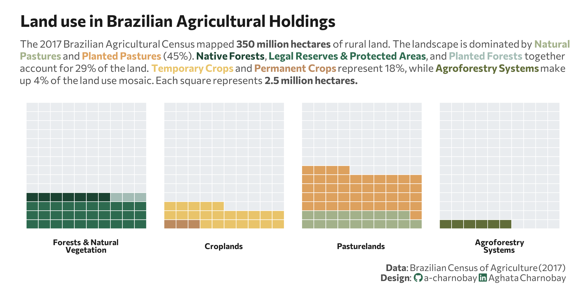

<br>
<br>



## 1 Setup

### 1.1 Create R and Python connection

```{r}
#| label: Create R and Python connection

library(reticulate)
use_virtualenv("r-reticulate", required = TRUE) 
#py_config()

```

### 1.2 Load data

```{python}
#| label: Load and clean dataset with Python
#| output: false

import agrobr
import asyncio
import pandas as pd
import numpy as np

from agrobr import ibge

df = asyncio.run(agrobr.datasets.censo_agropecuario("uso_terra"))
print(df.head())

df_clean = df[
    (df['ano'] == 2017) & 
    (df['unidade'] == 'hectares')
].copy()

```

### 1.3 Load R packages

```{r}
#| label: Load R packages
#| output: false

library(tidytext)
library(ggtext)       
library(showtext) 
library(stringr)
library(tidyverse)
library(waffle)
library(here)

```

### 1.4 Set theme

```{r}
#| label: Theme and appearance

# Font setup 
font_add_google("Commissioner")
showtext_auto()
showtext_opts(dpi = 300)
font_main <- "Commissioner"

# Font Awesome for caption
font_add(family = "fa-brands", regular = here("fonts", "Font Awesome 7 Brands-Regular-400.otf"))

# Colors
title_col <- "grey10"
text_col  <- "grey30"
bg_col    <- "#F2F4F8"

```

## 2 Prepare data for plotting

```{r}
#| lable: Prepare for plotting

n_rows_waffle <- 10
total_squares_goal <- 140

# Define waffle category order
custom_order <- c(
  "Forests & Natural<br>Vegetation", 
  "Croplands", 
  "Pasturelands", 
  "Agroforestry<br>Systems", 
  "Others"
)

# Renaming category column
df_waffle_final <- py$df_clean |>
  filter(!is.na(valor)) |>
  mutate(
    category = case_when(
      str_detect(categoria, fixed("agroflorestais", ignore_case = TRUE)) ~ "Agroforestry<br>Systems",
      str_detect(categoria, fixed("Lavouras", ignore_case = TRUE)) ~ "Croplands",
      str_detect(categoria, fixed("Pastagens", ignore_case = TRUE)) ~ "Pasturelands",
      str_detect(categoria, fixed("Matas", ignore_case = TRUE)) | 
        str_detect(categoria, fixed("florestas", ignore_case = TRUE)) ~ "Forests & Natural<br>Vegetation",
      TRUE ~ "Others"
    ),
    # Renaming subcategory
    subcategory = case_when(
      category == "Pasturelands" & str_detect(categoria, "naturais") ~ "Natural Pasture",
      category == "Pasturelands" & str_detect(categoria, "más condições") ~ "Planted (Degraded)",
      category == "Pasturelands" & str_detect(categoria, "boas condições") ~ "Planted (Good)",
      category == "Croplands" & str_detect(categoria, "permanentes") ~ "Permanent Crop",
      category == "Croplands" & str_detect(categoria, "temporárias") ~ "Temporary Crop",
      category == "Croplands" & str_detect(categoria, "flores") ~ "Temporary Crop",
      str_detect(category, "Forests") & str_detect(categoria, "plantadas") ~ "Planted Forest",
      str_detect(category, "Forests") & str_detect(categoria, "preservação") ~ "Legal Reserve/APP",
      str_detect(category, "Forests") & str_detect(categoria, "naturais") ~ "Native Forest",
      str_detect(category, "Agroforestry") ~ "Agroforestry",
      TRUE ~ "Other Land Uses"
    )
  ) |>
  group_by(category, subcategory) |>
  summarise(valor = sum(valor), .groups = "drop") |>
  group_by(category) |>
  mutate(
    squares = as.integer(round(valor / 2500000)),
    # Agroforestry to have at elast one square
    squares = if_else(valor > 0 & squares == 0, 1L, squares)
  ) |>
  group_modify(~ {
    used_squares <- sum(.x$squares)
    bind_rows(.x, tibble(subcategory = "Rest of Brazil", valor = 0, squares = total_squares_goal - used_squares))
  }) |>
  filter(category != "Others") |>
  ungroup() |>
  # Transforming in factor for correct order to apply
  mutate(category = factor(category, levels = custom_order))

palette <- c(
  "Natural Pasture" = "#a3b18a", "Planted (Degraded)" = "#dda15e", "Planted (Good)" = "#dda15e",
  "Permanent Crop" = "#BC8A5F", "Temporary Crop" = "#E9C46A",
  "Planted Forest" = "#A3BCB5", "Native Forest" = "#1B4332", "Legal Reserve/APP" = "#2D6A4F",
  "Agroforestry" = "#606c38", "Other Land Uses" = "#B0B0B0",
  "Rest of Brazil" = "#e9ecef" 
)

```

## 3 Plot

```{r}
#| lable: Plot
#| fig-width: 8
#| fig-height: 4

p <- ggplot(df_waffle_final, aes(fill = subcategory, values = squares)) +
  geom_waffle(color = "white", size = .25, n_rows = n_rows_waffle, flip = TRUE) +
  facet_wrap(~category, nrow = 1, strip.position = "bottom") +
  scale_fill_manual(values = palette) +
  labs(
    title = "Land use in Brazilian Agricultural Holdings",
    subtitle = paste0(
"The 2017 Brazilian Agricultural Census mapped <b>350 million hectares</b> of rural land. ",
"The landscape is dominated by <span style='color:#a3b18a;'><b>Natural<br>Pastures</b></span> and ",
"<span style='color:#dda15e;'><b>Planted Pastures</b></span> (45%). ",
"<span style='color:#1B4332;'><b>Native Forests</b></span>, ",
"<span style='color:#2D6A4F;'><b>Legal Reserves & Protected Areas</b></span>, and ",
"<span style='color:#A3BCB5;'><b>Planted Forests</b></span> together<br>account for 29% of the land. ",
"<span style='color:#E9C46A;'><b>Temporary Crops</b></span> and ",
"<span style='color:#BC8A5F;'><b>Permanent Crops</b></span> represent 18%, ",
"while <span style='color:#606c38;'><b>Agroforestry Systems</b></span> make<br>up 4% of the land use mosaic. ",
"Each square represents <b>2.5 million<b> hectares."
),
    caption = paste0(
      "**Data**:  Brazilian Census of Agriculture (2017)",
      "<br>**Design**: <span style='font-family:fa-brands; color:#2D6A4F;'>&#xf09b;</span> a-charnobay ",
      "<span style='font-family:fa-brands; color:#2D6A4F;'>&#xf08c;</span> Aghata Charnobay"
    )
  ) +
  theme_minimal(base_family = font_main) +
  theme(
    plot.title = element_text(face = "bold", size = 16, color = title_col,margin = margin(t = 5, b = 10)),
    plot.subtitle = element_markdown(size = 10, color = text_col, margin = margin(b = 10),lineheight = 1.2),
    plot.title.position = "plot",
    plot.caption = element_markdown(size = 9, color = text_col, lineheight = 1.1),
    plot.background = element_rect(fill = "white", color = NA), 
    panel.background = element_rect(fill = "white", color = NA),
    plot.margin = margin(10, 20, 10, 20),
    panel.grid = element_blank(),
    axis.text.x = element_blank(),
    axis.text.y = element_blank(),
    legend.position = "none",
    strip.text = element_markdown(face = "bold", size = 8),
  )

```

```{r}
#| label: Save plot
#| include: false
#| eval: false

ggsave(
  filename = "plot.png", 
  plot = p,
  width = 8, 
  height = 4,
  dpi = 300,
  bg = "white"
)
```
