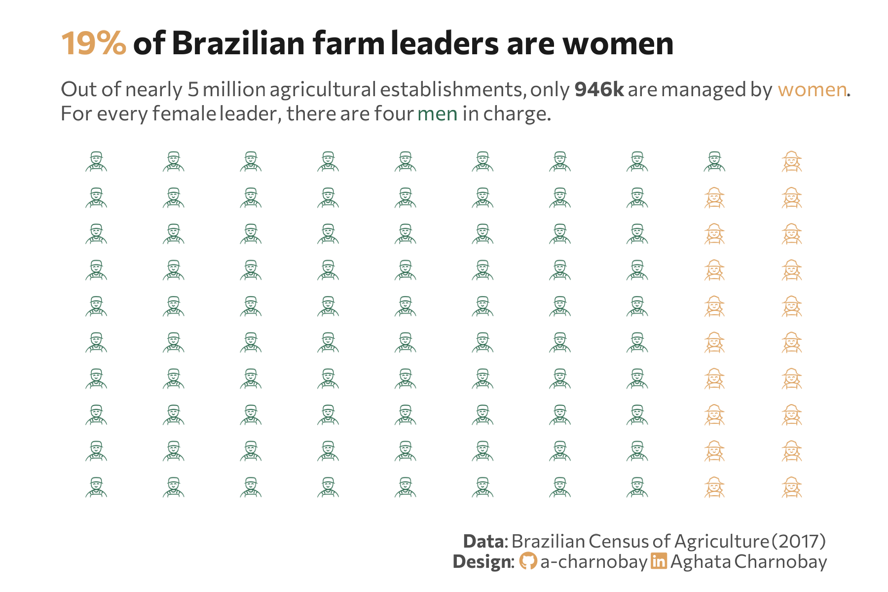

<br> <br>



## 1 Setup

### 1.1 Load R packages

```{r}
#| label: Load R packages

library(sidrar)
library(waffle)
library(extrafont)
library(tidyverse)
library(here)
library(colorblindr)
library(ggimage)
library(ggtext)
library(showtext) 
```

### 1.2 Load data

```{r}
#| label: Load data from IBGE API - Sidra

# Table 8917: Number of farms by farmer sex
# https://ftp.ibge.gov.br/Censo_Agropecuario/Censo_Agropecuario_2017/Caracteristicas_Gerais/indice_de_tabelas_censoagro_car# acteristicas_gerais.pdf

farmer_gender <- get_sidra(x = "8917",
                        geo = "Brazil")
```

### 1.3 Set theme

```{r}
#| label: Theme and appearance

# Font setup 
font_add_google("Commissioner")
showtext_auto()
showtext_opts(dpi = 300)
font_main <- "Commissioner"

# Font Awesome for caption
font_add(family = "fa-brands", regular = here("fonts", "Font Awesome 7 Brands-Regular-400.otf"))

# Colors
title_col <- "grey10"
text_col  <- "grey30"
bg_col    <- "#F2F4F8"

```

## 2 Prepare data for plotting

```{r}
#| label: Prepare for plotting

# Data prep
farmer_gender_clean <- farmer_gender |>
  filter(`Condição legal das terras` == "Total", 
         `Cor ou raça do produtor` == "Total",
         `Condição do produtor em relação às terras` == "Total",
         `Unidade de Medida` == "Unidades") |>
  filter(`Sexo do produtor` %in% c("Homens", "Mulheres", "Não se aplica")) |>
  mutate(valor_num = as.numeric(as.character(Valor))) |>
  group_by(`Sexo do produtor`) |>
  summarise(total_valor = sum(valor_num)) |>
  mutate(
    percentual = (total_valor / sum(total_valor)) * 100,
    squares = as.integer(round(percentual))
  )

# Icon adjustments

img_man   <- "icons/farmer_man.png"
img_woman <- "icons/farmer_woman.png"

plot_data <- expand.grid(
    x = 1:10,
    y = 1:10
  ) %>%
  as_tibble() %>%
  arrange(x, y) %>%
  mutate(img = case_when(
    row_number() <= 81 ~ img_man,
    TRUE ~ img_woman
  )) %>%
  mutate(
    icon_color = if_else(img == img_man, "#2D6A4F", "#dda15e")
  )

```

## 3 Plot

```{r}
#| label: Plot

p <- ggplot(data = plot_data) +
  geom_image(
    mapping = aes(x = x, y = y, image = img, color = icon_color),
    size = 0.06, 
    by = "height"
  ) +
  scale_color_identity() +
  scale_y_reverse() + 
  labs(
    title = "<span style='color:#dda15e;'>19%</span> of Brazilian farm leaders are women",
    subtitle = "Out of nearly 5 million agricultural establishments, only **946k** are managed by <span style='color:#dda15e;'>women</span>.<br>For every female leader, there are four <span style='color:#2D6A4F;'>men</span> in charge.",
    caption = paste0(
      "**Data**:  Brazilian Census of Agriculture (2017)",
      "<br>**Design**: <span style='font-family:fa-brands; color: #dda15e;'>&#xf09b;</span> a-charnobay ",
      "<span style='font-family:fa-brands; color:#dda15e;'>&#xf08c;</span> Aghata Charnobay"
    )
  ) +
  coord_cartesian(expand = TRUE, clip = "off") +
  theme_minimal(base_family = font_main) +
  theme_minimal(base_family = font_main) +
  theme(
    plot.title = element_markdown(face = "bold", size = 16, color = title_col,margin = margin(t = 5, b = 10)),
    plot.subtitle = element_markdown(size = 10, color = text_col, margin = margin(b = 10),lineheight = 1.2),
    plot.title.position = "plot",
    plot.caption = element_markdown(size = 9, color = text_col, lineheight = 1.1, margin = margin(t = 15)),
    plot.background = element_rect(fill = "white", color = NA), 
    panel.background = element_rect(fill = "white", color = NA),
    plot.margin = margin(10, 30, 10, 30),
    panel.grid = element_blank(),
    axis.text.x = element_blank(),
    axis.text.y = element_blank(),
    axis.title.x = element_blank(),
    axis.title.y = element_blank(),
    legend.position = "none",
  )

#cvd_grid(p) # check color accessibility
```

```{r}
#| label: Save plot
#| include: false
#| eval: false

ggsave(
  filename = "plot.png", 
  plot = p,
  width = 6, 
  height = 4,
  dpi = 300,
  bg = "white"
)
```

