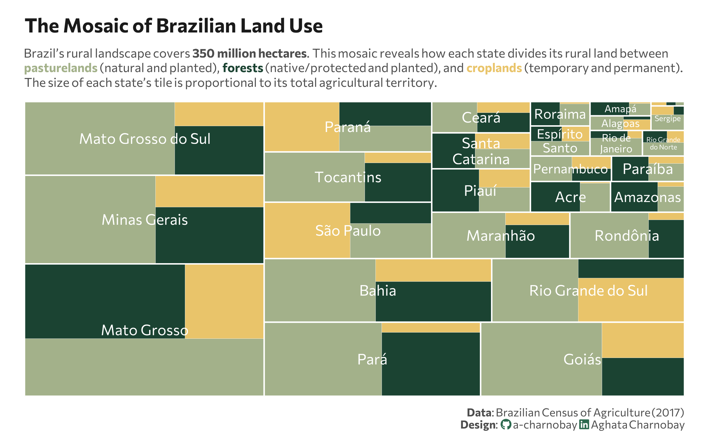

<br>
<br>



## 1 Setup

### 1.1 Create R and Python connection

```{r}
#| label: Create R and Python connection

library(reticulate)
use_virtualenv("r-reticulate", required = TRUE)
```

### 1.2 Load data

```{python}
#| label: Load and clean dataset with Python
#| output: false

import agrobr
import asyncio
import pandas as pd
import numpy as np

from agrobr import ibge

df = asyncio.run(agrobr.datasets.censo_agropecuario("uso_terra"))
print(df.head())

df_clean = df[
    (df['ano'] == 2017) & 
    (df['unidade'] == 'hectares')
].copy()

```

### 1.3 Load R packages

```{r}
#| label: Load R packages
#| output: false

library(tidytext)
library(ggtext)      
library(showtext) 
library(stringr)
library(tidyverse)
library(treemapify) 
library(here)
```

### 1.4 Set theme

```{r}
#| label: Theme and appearance

# Font setup 
font_add_google("Commissioner")
showtext_auto()
showtext_opts(dpi = 300)
font_main <- "Commissioner"

# Font Awesome for caption
font_add(family = "fa-brands", regular = here("fonts", "Font Awesome 7 Brands-Regular-400.otf"))

# Colors
title_col <- "grey10"
text_col  <- "grey30"
bg_col    <- "#F2F4F8"

# Palette for subtitle
col_pasture <- "#a3b18a"
col_forest  <- "#1B4332"
col_crop    <- "#E9C46A"

# Palette for categories
palette <- c(
  "Forests"      = "#1B4332",
  "Croplands"    = "#E9C46A",
  "Pasturelands" = "#a3b18a",
  "Agroforestry" = "#606c38",
  "Others"       = "#B0B0B0"
)
```

## 2 Prepare data for plotting

```{r}
#| lable: Prepare for plotting

# Processing the Python data frame
df_mosaic_final <- py$df_clean |>
  filter(!is.na(valor), valor > 0) |>
  mutate(
    # Simplified categories (no subcategories)
    category = case_when(
      str_detect(categoria, fixed("agroflorestais", ignore_case = TRUE)) ~ "Agroforestry",
      str_detect(categoria, fixed("Lavouras", ignore_case = TRUE)) ~ "Croplands",
      str_detect(categoria, fixed("Pastagens", ignore_case = TRUE)) ~ "Pasturelands",
      str_detect(categoria, fixed("Matas", ignore_case = TRUE)) | 
        str_detect(categoria, fixed("florestas", ignore_case = TRUE)) ~ "Forests",
      TRUE ~ "Others"
    )
  ) |>
  # Grouping by State (localidade) and Category
  group_by(localidade, category) |>
  summarise(valor = sum(valor), .groups = "drop") |>
  filter(category != "Agroforestry") |>
  filter(category != "Others")

```

## 3 Plot

```{r}
#| label: Plot

p <- ggplot(df_mosaic_final, 
            aes(area = valor, 
                fill = category, 
                label = localidade, 
                subgroup = localidade)) + # Changed subgroup to localidade
  # Draw the categories inside the state groups
  geom_treemap(color = "white", size = 0.2) +
  geom_treemap_subgroup_border(color = "white", size = 1.5) +
 # state labels
  geom_treemap_subgroup_text(
    place = "center", 
    grow = FALSE, 
    reflow = TRUE,
    colour = "white", 
    family = font_main,
    size = 12
  ) +
  scale_fill_manual(values = palette) +
  labs(
    title = "The Mosaic of Brazilian Land Use",
    subtitle = paste0(
  "Brazil's rural landscape covers **350 million hectares**. This mosaic reveals how each state divides its rural land between<br>",
  "<span style='color:", col_pasture, ";'><b>pasturelands</b></span> (natural and planted), ",
  "<span style='color:", col_forest, ";'><b>forests</b></span> (native/protected and planted), and ",
  "<span style='color:", col_crop, ";'><b>croplands</b></span> (temporary and permanent).<br>",
  "The size of each state's tile is proportional to its total agricultural territory."
),
    caption = paste0(
      "**Data**: Brazilian Census of Agriculture (2017)",
      "<br>**Design**: <span style='font-family:fa-brands; color:#2D6A4F;'>&#xf09b;</span> a-charnobay ",
      "<span style='font-family:fa-brands; color:#2D6A4F;'>&#xf08c;</span> Aghata Charnobay"
    ),
    fill = "Category"
  ) +
  theme_minimal(base_family = font_main) +
  theme(
    plot.title = element_text(face = "bold", size = 16, color = title_col,margin = margin(t = 5, b = 10)),
    plot.subtitle = element_markdown(size = 10, color = text_col, margin = margin(b = 10),lineheight = 1.2),
    plot.title.position = "plot",
    plot.caption = element_markdown(size = 9, color = text_col, lineheight = 1.1, margin = margin(t = 10)),
    plot.background = element_rect(fill = "white", color = NA), 
    panel.background = element_rect(fill = "white", color = NA),
    plot.margin = margin(10, 20, 10, 20),
    panel.grid = element_blank(),
    axis.text.x = element_blank(),
    axis.text.y = element_blank(),
    legend.position = "none",
  )
```


```{r}
#| label: Save plot
#| include: false
#| eval: false

ggsave(
  filename = "plot.png", 
  plot = p,
  width = 8, 
  height = 5,
  dpi = 300,
  bg = "white"
)
```

