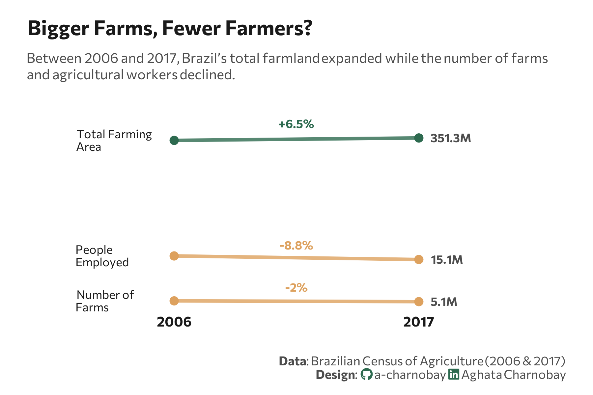

<br> <br>



## 1 Setup

### 1.1 Load R packages

```{r}
#| label: Load R packages
#| output: false

library(tidytext)
library(ggtext)       
library(showtext) 
library(stringr)
library(tidyverse)
library(here)
library(scales)
library(colorblindr)
```
### 1.2 Load data

```{r}
#| label: Create dataset 
#| output: false

data <- tibble(
  category = c("total_area_farm_holdings", "n_farm_holdings", "n_occupied_people"),
  un = c("ha", "n", "n"),
  y_2006 = c(329941393, 5175489, 16568205),
  y_2017 = c(351289816, 5073324, 15105125)
)
```

### 1.3 Set theme

```{r}
#| label: Theme and appearance

# Font setup 
font_add_google("Commissioner")
showtext_auto()
showtext_opts(dpi = 300)
font_main <- "Commissioner"

# Font Awesome for caption
font_add(family = "fa-brands", regular = here("fonts", "Font Awesome 7 Brands-Regular-400.otf"))

# Colors
title_col <- "grey10"
text_col  <- "grey30"
bg_col    <- "#F2F4F8"

col_increase <- "#2D6A4F" 
col_decrease <- "#dda15e" 

```

## 2 Prepare data for plotting

```{r}
#| lable: Prepare for plotting

df <- data%>%
  mutate(
    category = case_match(
      category,
      "total_area_farm_holdings" ~ "Total Farming\nArea",
      "n_farm_holdings"          ~ "Number of\nFarms",
      "n_occupied_people"        ~ "People\nEmployed",
      .default = category
    ),
    pct_change = ((y_2017 - y_2006) / y_2006) * 100,
    label_pct = paste0(ifelse(pct_change > 0, "+", ""), round(pct_change, 1), "%"),
    line_color = ifelse(pct_change > 0, col_increase, col_decrease)
  ) %>%
  pivot_longer(cols = c(y_2006, y_2017), names_to = "year", values_to = "value") %>%
  mutate(
    year = str_replace(year, "y_", ""),
    value_label = label_number(accuracy = 0.1, scale_cut = cut_short_scale())(value)
  )
```

## 3 Plot

```{r}
#| lable: Plot

p <- ggplot(df, aes(x = year, y = value, group = category)) +
  # Slope lines
  geom_line(aes(color = line_color), size = 1.2, alpha = 0.8) +
  # Endpoints
  geom_point(aes(color = line_color), size = 2.5) +
  # Category Names
  geom_text(
    data = df %>% filter(year == "2006"),
    aes(label = category),
    x = 0.6,          
    hjust = 0,         
    vjust = 0.5,       
    lineheight = 0.9,  
    family = font_main, 
    size = 3, 
    color = title_col
  ) +
  # Abbreviated Values
  geom_text(
    data = df %>% filter(year == "2017"),
    aes(label = value_label),
    x = 2.05, 
    hjust = 0, 
    family = font_main, 
    size = 3, 
    color = text_col, 
    fontface = "bold"
  ) +
  # Percentage Change
  geom_text(
    data = df %>% filter(year == "2017"),
    aes(label = label_pct, color = line_color),
    x = 1.5, 
    vjust = -1.2, 
    family = font_main, 
    size = 3, 
    fontface = "bold"
  ) +
  scale_color_identity() +
  scale_y_log10() + 
  labs(
    title = "Bigger Farms, Fewer Farmers?",
    subtitle = "Between 2006 and 2017, Brazil’s total farmland expanded while the number of farms<br>and agricultural workers declined.",
    caption = paste0(
      "**Data**:  Brazilian Census of Agriculture (2006 & 2017)",
      "<br>**Design**: <span style='font-family:fa-brands; color:#2D6A4F;'>&#xf09b;</span> a-charnobay ",
      "<span style='font-family:fa-brands; color:#2D6A4F;'>&#xf08c;</span> Aghata Charnobay"
    )
  ) +
  coord_cartesian(clip = "off") + 
 # styling
  theme_minimal(base_family = font_main) +
  theme(
    plot.title = element_text(face = "bold", size = 15, color = title_col, margin = margin(t = 5, b = 10)),
    plot.subtitle = element_markdown(size = 10, color = text_col, margin = margin(b = 35), lineheight = 1.2),
    plot.title.position = "plot",
    plot.caption = element_markdown(size = 9, color = text_col, lineheight = 1.1, margin = margin(t = 20)),
    plot.background = element_rect(fill = "white", color = NA), 
    panel.background = element_rect(fill = "white", color = NA),
    plot.margin = margin(10, 20, 10, 20), # Added more margin to prevent clipping
    panel.grid = element_blank(),
    axis.text.y = element_blank(),
    axis.title = element_blank(),
    axis.text.x = element_text(size = 10, face = "bold", color = title_col),
    legend.position = "none"
  )
```

```{r}
#| label: Save plot
#| include: false
#| eval: false

ggsave(
  filename = "plot.png", 
  plot = p,
  width = 6, 
  height = 4,
  dpi = 300,
  bg = "white"
)
```


