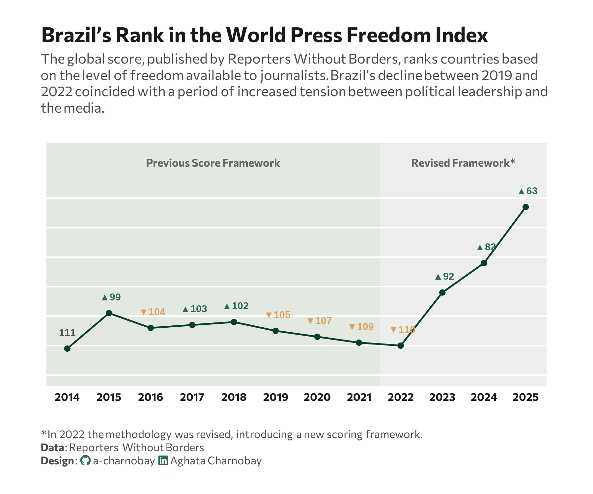

<br> <br>



## 1 Setup

### 1.1 Load R packages

```{r}
#| label: Load R packages
#| output: false

library(tidytext)
library(ggtext)       
library(showtext) 
library(stringr)
library(tidyverse)
library(here)
library(readxl)

```

### 1.2 Load data

```{r}
#| label: Load data
#| output: false

df <- read_excel("reporters_withouth_borders_brazil.xlsx", 
    na = "NA")

```

### 1.3 Set theme

```{r}
#| label: Theme and appearance

# Font setup 
font_add_google("Commissioner")
showtext_auto()
showtext_opts(dpi = 300)
font_main <- "Commissioner"

# Font Awesome for caption
font_add(family = "fa-brands", regular = here("fonts", "Font Awesome 7 Brands-Regular-400.otf"))

# Colors
title_col <- "grey10"
text_col  <- "grey30"
bg_col    <- "#F2F4F8"
col_primary  <- "#0B3D2E" 
col_increase <- "#2D6A4F" 
col_decrease <- "#dda15e" 

```

## 2 Prepare data for plotting

```{r}
#| lable: Prepare for plotting

df_plot <- df |>
  mutate(
    global_index = as.numeric(str_replace(global_index, ",", ".")),
    global_position = as.numeric(global_position)
  ) |>
  arrange(year) |>
  mutate(
    # Calculate the change in position
    pos_diff = global_position - lag(global_position),
    # Create the label: Rank + Arrow 
    arrow = case_when(
      is.na(pos_diff) ~ "",
      pos_diff < 0   ~ " \u25B2", 
      pos_diff > 0   ~ " \u25BC", 
      TRUE           ~ " \u25A0"
    ),
    arrow_color = case_when(
      pos_diff < 0 ~ col_increase,
      pos_diff > 0 ~ col_decrease,
      TRUE         ~ text_col
    ),
    full_label = paste0(arrow,global_position),
    # Grouping for the methodology break 
    period = ifelse(year <= 2021, "Old Method", "New Method")
  )

methodology_zones <- data.frame(
  xmin = c(2013.5, 2021.5),
  xmax = c(2021.5, 2025.5),
  fill_color = c("#B8C5B4", "#D1D1D1"), 
  label = c("Previous Score Framework", "Revised Framework*")
)

```

## 3 Plot

```{r}
#| lable: Plot

p <- ggplot(df_plot, aes(x = year, y = global_position)) + 
  geom_rect(data = methodology_zones, 
            aes(xmin = xmin, xmax = xmax, ymin = -Inf, ymax = Inf, fill = fill_color),
            alpha = 0.4, inherit.aes = FALSE) + 
  geom_hline(yintercept = seq(60, 120, by = 10), color = "white", size = 0.5) +
  geom_text(data = methodology_zones, 
            aes(x = (xmin + xmax)/2, y = 48, label = label),
            family = font_main, size = 2.8, color = "grey40", fontface = "bold", inherit.aes = FALSE) +
  geom_line(aes(group = 1), color = col_primary, size = 0.6) +
  geom_point(color = col_primary, size = 1.5) +
  geom_text(aes(label = full_label, color = arrow_color), 
            vjust = -1.9, family = "sans", fontface = "bold", size = 2.5) +
  scale_fill_identity() + 
  scale_color_identity() +
  scale_x_continuous(breaks = 2014:2025, expand = c(0.01, 0.01)) +
  scale_y_reverse(limits = c(120, 45), breaks = seq(40, 120, by = 10)) + 
  labs(
    title = "Brazil’s Rank in the World Press Freedom Index",
    subtitle = "The global score, published by Reporters Without Borders, ranks countries based<br>on the level of freedom available to journalists. Brazil’s decline between 2019 and<br>2022 coincided with a period of increased tension between political leadership and<br>the media.",
    caption = paste0(
      "<span>* In 2022 the methodology was revised, introducing a new scoring framework.</span><br>",
      "**Data**: Reporters Without Borders",
      "<br>**Design**: <span style='font-family:fa-brands; color:#2D6A4F;'>&#xf09b;</span> a-charnobay ", 
      "<span style='font-family:fa-brands; color:#2D6A4F;'>&#xf08c;</span> Aghata Charnobay"
    )
  ) +
  # styling
  theme_minimal(base_family = font_main) +
  theme(
    plot.title = element_text(face = "bold", size = 15, color = title_col),
    plot.subtitle = element_markdown(size = 10, color = text_col, margin = margin(b = 20), lineheight = 1.2),
    plot.caption.position = "plot",
    plot.caption = element_markdown(size = 8, color = text_col, hjust = 0, margin = margin(t = 20), lineheight = 1.2),
    panel.grid = element_blank(), 
    axis.text.y = element_blank(), # Kept blank as per your formatting
    axis.text.x = element_text(size = 8, face = "bold", color = title_col),
    axis.title = element_blank(),
    plot.background = element_rect(fill = "white", color = NA),
    plot.margin = margin(20, 30, 20, 30)
  ) +
  coord_cartesian(clip = "off")
```

```{r}
#| label: Save plot
#| include: false
#| eval: false

ggsave(
  filename = "plot.png", 
  plot = p,
  width = 6, 
  height = 5,
  dpi = 300,
  bg = "white"
)
```