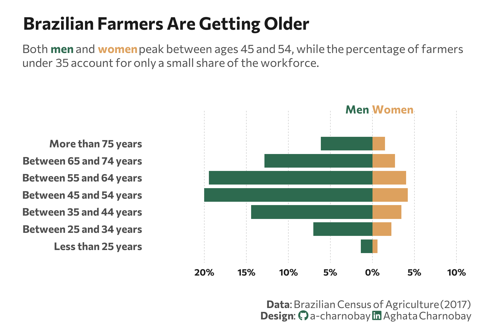

<br> <br>



## 1 Setup

### 1.1 Load R packages

```{r}
#| label: Load R packages
#| output: false

library(tidytext)
library(ggtext)       
library(showtext) 
library(stringr)
library(tidyverse)
library(here)

```


### 1.2 Load data

```{r}

df_age <- data.frame(
  age_group = c("Less than 25 years", "Between 25 and 34 years", "Between 35 and 44 years", 
                "Between 45 and 54 years", "Between 55 and 64 years", "Between 65 and 74 years", "More than 75 years"),
  Men = c(70441, 355271, 729552, 1011631, 983964, 649444, 310147),
  Women = c(29916, 113797, 174591, 212857, 202738, 136185, 75991)
)

```


### 1.3 Set theme

```{r}
#| label: Theme and appearance

# Font setup 
font_add_google("Commissioner")
showtext_auto()
showtext_opts(dpi = 300)
font_main <- "Commissioner"

# Font Awesome for caption
font_add(family = "fa-brands", regular = here("fonts", "Font Awesome 7 Brands-Regular-400.otf"))

# Colors
title_col <- "grey10"
text_col  <- "grey30"
bg_col    <- "#F2F4F8"
col_men <- "#2D6A4F"   
col_women <- "#dda15e" 

```

## 2 Prepare data for plotting

```{r}
#| lable: Prepare for plotting

df_long <- df_age |>
  mutate(total = Men + Women) |>
  mutate(
    Men = (Men / sum(total)) * 100,
    Women = (Women / sum(total)) * 100
  ) |>
  pivot_longer(cols = c(Men, Women), names_to = "Gender", values_to = "Percentage") |>
  mutate(
    plot_value = ifelse(Gender == "Men", -Percentage, Percentage),
    age_group = factor(age_group, levels = c("Less than 25 years", "Between 25 and 34 years", "Between 35 and 44 years", 
                                           "Between 45 and 54 years", "Between 55 and 64 years", "Between 65 and 74 years", "More than 75 years"))
  )

```

## 3 Plot

```{r}
#| lable: Plot

p <- ggplot(df_long, aes(x = age_group, y = plot_value, fill = Gender)) +
  geom_col(width = 0.8) +
  coord_flip(clip = "off") + 
  geom_vline(xintercept = 0, color = "white", size = 0.5) +
  scale_y_continuous(
    labels = function(x) paste0(abs(x), "%"), 
    limits = c(-25, 10), 
    breaks = seq(-20, 10, 5) 
  ) +
  scale_fill_manual(values = c("Men" = col_men, "Women" = col_women)) +
  # Labels 
  labs(
    title = "Brazilian Farmers Are Getting Older",
    subtitle = paste0(
  "Both <span style='color:", col_men, ";'><b>men</b></span> and <span style='color:", col_women, ";'><b>women</b></span> peak between ages 45 and 54, while the percentage of farmers<br>under 35 account for only a small share of the workforce."
),
  caption = paste0(
      "**Data**: Brazilian Census of Agriculture (2017)",
      "<br>**Design**: <span style='font-family:fa-brands; color:#2D6A4F;'>&#xf09b;</span> a-charnobay ", 
      "<span style='font-family:fa-brands; color:#2D6A4F;'>&#xf08c;</span> Aghata Charnobay"
    ),
    x = NULL, 
    y = NULL
  ) +
  # Styling
  theme_minimal(base_family = font_main) +
  theme(
    panel.grid.major.x = element_line(color = "grey70", size = 0.15, linetype = "dashed"), 
    panel.grid.minor = element_blank(),
    panel.grid.major.y = element_blank(), 
    plot.title = element_text(face = "bold", size = 15, color = title_col, margin = margin(t = 5, b = 10)),
    plot.subtitle = element_markdown(size = 10, color = text_col, margin = margin(b = 35), lineheight = 1.2),
    plot.title.position = "plot",
    plot.caption = element_markdown(size = 9, color = text_col, lineheight = 1.1, margin = margin(t = 20)),
    plot.background = element_rect(fill = "white", color = NA), 
    panel.background = element_rect(fill = "white", color = NA),
    plot.margin = margin(10, 25, 10, 20),
    axis.text.x = element_text(size = 8, face = "bold", color = title_col),
    axis.text.y = element_text(size = 9, face = "bold", color = text_col),
    axis.title = element_blank(),
    legend.position = "none"
  ) +
  # Manual annotations 
  annotate("text", x = 9, y = -1.8, label = "Men", 
           family = font_main, fontface = "bold", color = col_men, size = 3.5) +
  annotate("text", x = 9, y = 2.4, label = "Women", 
           family = font_main, fontface = "bold", color = col_women, size = 3.5)

```

```{r}
#| label: Save plot
#| include: false
#| eval: false

ggsave(
  filename = "plot.png", 
  plot = p,
  width = 6, 
  height = 4,
  dpi = 300,
  bg = "white"
)
```