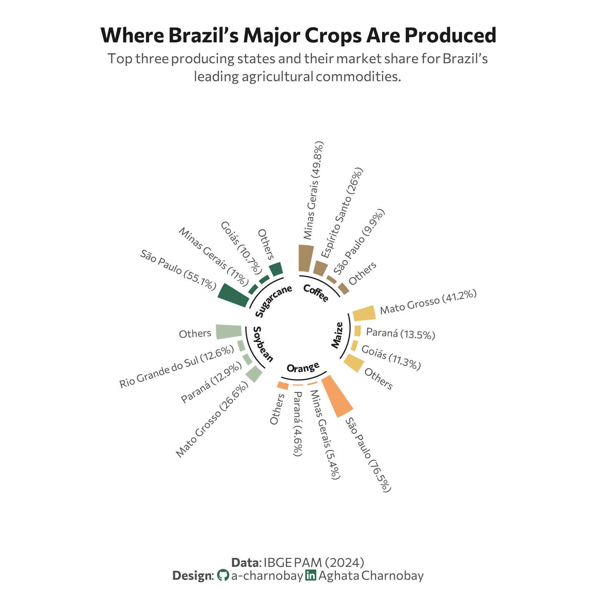

<br> <br>

{fig-align="center" width="504"}

## 1 Setup

### 1.1 Create R and Python connection

```{r}
#| label: Create R and Python connection

library(reticulate)
use_virtualenv("r-reticulate", required = TRUE) 
#py_config()

```

### 1.2 Load R packages

```{r}
#| label: Load R packages
#| output: false

library(tidytext)
library(ggtext)       
library(showtext) 
library(stringr)
library(tidyverse)
library(here)
library(readxl)
library(geomtextpath)

```

### 1.3 Load data

```{python}
#| label: Load and clean dataset with Python
#| output: false

import agrobr
import asyncio
import pandas as pd
import numpy as np

from agrobr import ibge

orange = asyncio.run(ibge.pam('laranja', ano=2024, nivel='uf'))
print(orange)

soybean = asyncio.run(ibge.pam('soja', ano=2024, nivel='uf'))
print(soybean)

coffee = asyncio.run(ibge.pam('cafe', ano=2024, nivel='uf'))
print(coffee)

sugarcane = asyncio.run(ibge.pam('cana', ano=2024, nivel='uf'))
print(sugarcane)

maize = asyncio.run(ibge.pam('milho', ano=2024, nivel='uf'))
print(maize)

```

### 1.4 Creating the dataset

```{r}
#| label: Data wrangling and creation of dataset
#| output: false

# soybean

soybean <- py$soybean

soybean_final <- soybean %>%
  select(region = localidade, value = producao) %>%
  slice_max(value, n = 3) %>%
  add_row(region = "Brazil", value = sum(soybean$producao, na.rm = TRUE)) %>%
  mutate(crop = "Soybean")

# orange

orange <- py$orange

orange_final <- orange %>%
  select(region = localidade, value = producao) %>%
  slice_max(value, n = 3) %>%
  add_row(region = "Brazil", value = sum(orange$producao, na.rm = TRUE)) %>%
  mutate(crop = "Orange")

# coffee

coffee <- py$coffee

coffee_final <- coffee %>%
  select(region = localidade, value = producao) %>%
  slice_max(value, n = 3) %>%
  add_row(region = "Brazil", value = sum(coffee$producao, na.rm = TRUE)) %>%
  mutate(crop = "Coffee")

# sugarcane

sugarcane <- py$sugarcane

sugarcane_final <- sugarcane %>%
  select(region = localidade, value = producao) %>%
  slice_max(value, n = 3) %>%
  add_row(region = "Brazil", value = sum(sugarcane$producao, na.rm = TRUE)) %>%
  mutate(crop = "Sugarcane")

# maize

maize <- py$maize

maize_final <- maize %>%
  select(region = localidade, value = producao) %>%
  slice_max(value, n = 3) %>%
  add_row(region = "Brazil", value = sum(maize$producao, na.rm = TRUE)) %>%
  mutate(crop = "Maize")

# Join the datasets

raw_data_2024 <- bind_rows(
  soybean_final, 
  maize_final, 
  sugarcane_final, 
  coffee_final, 
  orange_final
)


```

### 1.5 Set theme

```{r}
#| label: Theme and appearance

# Font setup 
font_add_google("Commissioner")
showtext_auto()
showtext_opts(dpi = 300)
font_main <- "Commissioner"

# Font Awesome for caption
font_add(family = "fa-brands", regular = here("fonts", "Font Awesome 7 Brands-Regular-400.otf"))

# Colors
title_col <- "grey10"
text_col  <- "grey30"
bg_col    <- "#F2F4F8"

col_soy     <- "#ADC2A9" 
col_coffee  <- "#A68A64" 
col_sugar   <- "#2D6A4F" 
col_orange  <- "#F4A261" 
col_maize   <- "#E9C46A" 

```

## 2 Prepare data for plotting

```{r}
#| label: Prepare for plotting

df_radial <- raw_data_2024 |>
  group_by(crop) |>
  mutate(
    total_val = value[region == "Brazil"],
    pct = (value / total_val) * 100
  ) |>
  filter(region != "Brazil") |> 
  slice_max(order_by = pct, n = 3, with_ties = FALSE) |>
  # Add Others
  group_modify(~ add_row(.x, region = "Others", pct = 100 - sum(.x$pct))) |>
  arrange(crop, region == "Others", desc(pct)) |> 
  group_modify(~ add_row(.x, region = "GAP", pct = NA)) |> 
  ungroup() |>
  mutate(spoke_id = row_number()) |>
  mutate(
    fill_color = case_when(
      region == "GAP"    ~ NA_character_,
      crop == "Soybean"   ~ col_soy,
      crop == "Coffee"    ~ col_coffee,
      crop == "Sugarcane" ~ col_sugar,
      crop == "Orange"    ~ col_orange,
      crop == "Maize"     ~ col_maize,
      TRUE ~ "grey90"
    ),
    label_text = ifelse(region == "Others", "Others", 
                        paste0(region, " (", round(pct, 1), "%)"))
  )

df_labels <- df_radial |>
  filter(region != "GAP") |>
  mutate(
    angle = 90 - 360 * (spoke_id - 0.5) / max(df_radial$spoke_id),
    hjust = ifelse(angle < -90, 1, 0),
    angle = ifelse(angle < -90, angle + 180, angle)
  )

```

## 3. Plot

```{r}
#| label: Plot

p <- ggplot(df_radial, aes(x = spoke_id, y = pct, fill = fill_color)) +
  geom_col(width = 0.8, color = "white") + 
  # Structural setup
  ylim(-100, 170) + 
  coord_polar(start = 0) +
  scale_fill_identity() +
  # Data labels
  geom_text(data = df_labels,
            aes(label = label_text, y = pct + 8, angle = angle, hjust = hjust), 
            size = 2.6, family = font_main, color = text_col) +
  # Inner labels
  geom_segment(data = df_radial %>% filter(region != "GAP") %>% group_by(crop) %>% 
                 summarize(start = min(spoke_id) - 0.3, end = max(spoke_id) + 0.3),
               aes(x = start, xend = end, y = -7, yend = -7), 
               color = title_col, size = 0.4, inherit.aes = FALSE) +
  geom_textpath(data = df_radial %>% filter(region != "GAP") %>% group_by(crop) %>% 
                  summarize(start = min(spoke_id), end = max(spoke_id)),
                aes(x = (start + end)/2, y = -15, label = crop), 
                size = 2.5, fontface = "bold", color = title_col, 
                family = font_main, inherit.aes = FALSE, vjust = 0, hjust = 0.5) +
  # Labs
  labs(
    title = "Where Brazil’s Major Crops Are Produced",
    subtitle = "Top three producing states and their market share for Brazil’s<br>leading agricultural commodities.",
    caption = paste0(
      "**Data**: IBGE PAM (2024)",
      "<br>**Design**: <span style='font-family:fa-brands; color:#2D6A4F;'>&#xf09b;</span> a-charnobay ", 
      "<span style='font-family:fa-brands; color:#2D6A4F;'>&#xf08c;</span> Aghata Charnobay"
    )
  ) +
  #Styling
  theme_minimal(base_family = font_main) +
  theme(
    plot.title.position = "plot",
    plot.title = element_text(face = "bold", size = 15, color = title_col, hjust = 0.5,margin = margin(b = 5) ),
    plot.subtitle = element_markdown(size = 10, color = text_col, hjust = 0.5, lineheight = 1.3, margin = margin(b = 40)),
    plot.caption.position = "plot",
    plot.caption = element_markdown(size = 9, color = text_col, hjust = 0.5, margin = margin(t = 30)),
    panel.grid = element_blank(),
    axis.text = element_blank(),
    axis.title = element_blank(),
    plot.margin = margin(20, 30, 10, 30), # Centers the circle
    plot.background = element_rect(fill = "white", color = NA)
  )
```

```{r}
#| label: Save plot
#| include: false
#| eval: false

ggsave(
  filename = "plot.png", 
  plot = p,
  width = 6, 
  height = 6,
  dpi = 300,
  bg = "white"
)
```
