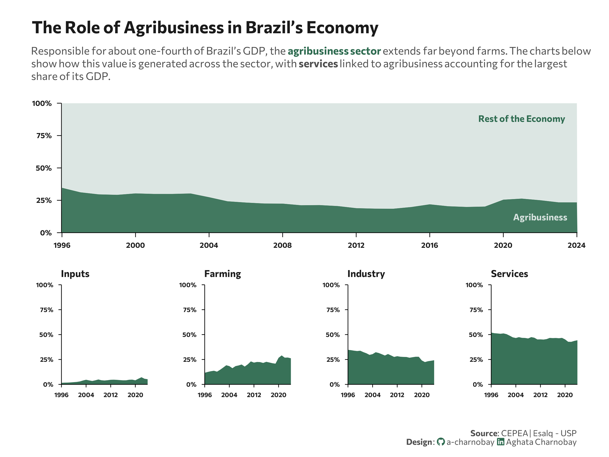

<br> <br>

{fig-align="center" width="510"}

## 1 Setup

### 1.1 Load R packages

```{r}
#| label: Load R packages
#| output: false

library(tidytext)
library(ggtext)       
library(showtext) 
library(stringr)
library(tidyverse)
library(here)
library(readxl)
library(scales)
library(patchwork)


```

### 1.2 Load data

```{r}
#| label: Load and clean dataset with Python
#| output: false

gdp_brazil <- read_excel("gdp_brazil.xlsx")

```

### 1.3 Set theme

```{r}
#| label: Theme and appearance

# Font setup 
font_add_google("Commissioner")
showtext_auto()
showtext_opts(dpi = 300)
font_main <- "Commissioner"

# Font Awesome for caption
font_add(family = "fa-brands", regular = here("fonts", "Font Awesome 7 Brands-Regular-400.otf"))

# Colors
title_col <- "grey10"
text_col  <- "grey30"
bg_col    <- "#F2F4F8"

col_agro  <- "#2D6A4F" 
col_other <- "#D8E3E0" 

col_inputs  <- "#2D6A4F"
col_farming <- "#2D6A4F"
col_industry<- "#2D6A4F"
col_services<- "#2D6A4F"
```

## 2 Prepare data for plotting

```{r}
#| label: Prepare for plotting

df_total <- gdp_brazil %>%
  mutate(Rest_of_Economy = 1 - agriculture_gdp_share) %>%
  rename(Agribusiness = agriculture_gdp_share) %>%
  select(year, Agribusiness, Rest_of_Economy) %>%
  pivot_longer(cols = -year, names_to = "Sector", values_to = "Share") %>%
  mutate(Sector = factor(Sector, levels = c("Rest_of_Economy","Agribusiness")))

df_sectors <- gdp_brazil %>%
  select(
    year,
    agro_inputs_share,
    primary_agriculture_share,
    agro_industry_share,
    agro_services_share
  ) %>%
  rename(
    Inputs = agro_inputs_share,
    Farming = primary_agriculture_share,
    Industry = agro_industry_share,
    Services = agro_services_share
  ) %>%
  pivot_longer(-year, names_to = "Sector", values_to = "Share")

```

## 3. Plot

```{r}
#| label: Plot

## Plot 1

p1 <- ggplot(df_total, aes(x = year, y = Share, fill = Sector)) +
  
  geom_area(alpha = 0.9, color = "white", linewidth = 0.1) +
  
  scale_y_continuous(
    labels = label_percent(),
    expand = c(0,0),
    breaks = seq(0,1,0.25)
  ) +
  
  scale_x_continuous(
    expand = c(0,0),
    breaks = seq(1996,2024,4)
  ) +
  
  scale_fill_manual(
    values = c(
      "Rest_of_Economy" = col_other,
      "Agribusiness" = col_agro
    )
  ) +
  
  labs(
    title = "The Role of Agribusiness in Brazil’s Economy",
    subtitle = paste0(
  "Responsible for about one-fourth of Brazil’s GDP, the ",
  "<span style='color:", col_agro, ";'><b>agribusiness sector</b></span> extends far beyond farms. The charts below<br>",
  "show how this value is generated across the sector, with ",
  "<b>services</b> linked to agribusiness accounting for the largest<br>",
  "share of its GDP."
),
x = NULL,
    y = NULL
  ) +
  
  theme_minimal(base_family = font_main) +
  theme(
    axis.line = element_line(color = "black", linewidth = 0.3),
    axis.ticks = element_line(color = "black", linewidth = 0.3),
    axis.ticks.length = unit(0.15,"cm"),
    panel.grid = element_blank(),
    plot.title.position = "plot",
    plot.title = element_text(face = "bold", size = 16, color = title_col, margin = margin(b=10)),
    plot.subtitle = element_markdown(size = 10, color = text_col, margin = margin(b=20), lineheight = 1.2),
    axis.text.x = element_text(size = 7, face = "bold", color = title_col),
    axis.text.y = element_text(size = 7, face = "bold", color = title_col),
    legend.position = "none"
  ) +
  
  annotate(
    "text",
    x = 2022,
    y = 0.12,
    label = "Agribusiness",
    family = font_main,
    fontface = "bold",
    color = col_other,
    size = 3
  ) +
  
  annotate(
    "text",
    x = 2021,
    y = 0.88,
    label = "Rest of the Economy",
    family = font_main,
    fontface = "bold",
    color = col_agro,
    size = 3
  )

## Plot 2

small_area <- function(dataset, sector_name, color){

  df_plot <- dataset %>%
    filter(Sector == sector_name)

  ggplot(df_plot, aes(year, Share)) +

    geom_area(fill = color, alpha = 0.95) +

    scale_y_continuous(
      limits = c(0, 1),
      labels = label_percent(),
      breaks = seq(0, 1, 0.25),
      expand = c(0, 0)
    ) +

    scale_x_continuous(
      expand = c(0,0),
      breaks = seq(1996,2024,8)
    ) +

    labs(
      title = sector_name,
      x = NULL,
      y = NULL
    ) +

    theme_minimal(base_family = font_main) +
    theme(
      panel.grid = element_blank(),
      axis.line = element_line(color="black",linewidth=0.3),
      axis.text = element_text(size=6,face="bold",color=title_col),
      axis.ticks = element_line(color="black",linewidth=0.3),
      axis.ticks.length = unit(0.1,"cm"),
      plot.title = element_text(
        size=9,
        face="bold",
        color=title_col,
        hjust=0
      )
    )
}

p_inputs  <- small_area(df_sectors,"Inputs",col_inputs)
p_farm    <- small_area(df_sectors,"Farming",col_farming)
p_ind     <- small_area(df_sectors,"Industry",col_industry)
p_serv    <- small_area(df_sectors,"Services",col_services)

p <- p1 /
  (p_inputs | p_farm | p_ind | p_serv) +
  plot_layout(heights = c(1.3,1))

p <- p +
  plot_annotation(
    caption = paste0(
      "**Source**: CEPEA | Esalq - USP",
      "<br>**Design**: <span style='font-family:fa-brands; color:#2D6A4F;'>&#xf09b;</span> a-charnobay ",
      "<span style='font-family:fa-brands; color:#2D6A4F;'>&#xf08c;</span> Aghata Charnobay"
    )
  ) &
  theme(
    plot.caption = element_markdown(
      size = 8, family = font_main,
      color = text_col,
      margin = margin(t = 20)
    ),
    plot.margin = margin(10, 15, 10, 15)
  )


```

```{r}
#| label: Save plot
#| include: false
#| eval: false

ggsave(
  filename = "plot.png", 
  plot = p,
  width = 8, 
  height = 6,
  dpi = 300,
  bg = "white"
)
```
