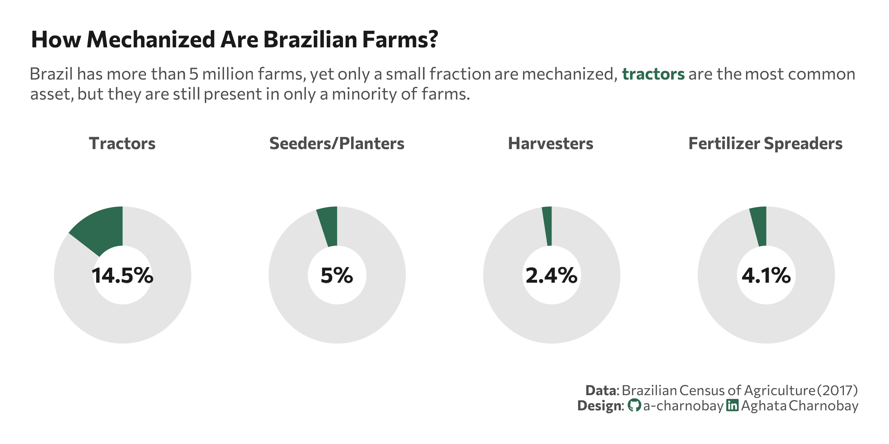

<br> <br>



## 1 Setup

### 1.1 Load R packages

```{r}
#| label: Load R packages
#| output: false

library(tidytext)
library(ggtext)       
library(showtext) 
library(stringr)
library(tidyverse)
library(here)
library(readxl)
library(sidrar)
library(patchwork)
```

### 1.2 Load data

```{r}
#| label: Load data from IBGE API - Sidra

# Table 6872: Number of rural establishments and agricultural machinery
# https://sidra.ibge.gov.br/tabela/6872

ag_machinery <- get_sidra(x = "6872",
                        geo = "Brazil")

```

### 1.3 Set theme

```{r}
#| label: Theme and appearance

# Font setup 
font_add_google("Commissioner")
showtext_auto()
showtext_opts(dpi = 300)
font_main <- "Commissioner"

# Font Awesome for caption
font_add(family = "fa-brands", regular = here("fonts", "Font Awesome 7 Brands-Regular-400.otf"))

# Colors
title_col <- "grey10"
text_col  <- "grey30"
col_bg    <- "white"
col_highlight <- "#2D6A4F"


```

## 2 Prepare data for plotting

```{r}
#| label: Prepare for plotting

ag_machinery_clean <- ag_machinery |>
  filter(`Variável` == "Número de estabelecimentos agropecuários",
    `Sexo do produtor` == "Total",
    `Tipologia` == "Total",
    `Classe de idade do produtor` == "Total"
         ) |>
  select(`Tratores, implementos e máquinas existentes no estabelecimento agropecuário`, Valor)

# totals
total_est <- ag_machinery_clean |> 
  filter(`Tratores, implementos e máquinas existentes no estabelecimento agropecuário` == "Total") |> 
  pull(Valor)

df_plot <- ag_machinery_clean |>
  filter(`Tratores, implementos e máquinas existentes no estabelecimento agropecuário` != "Total") |>
  mutate(
    item = case_match(
      `Tratores, implementos e máquinas existentes no estabelecimento agropecuário`,
      "Tratores" ~ "Tractors",
      "Semeadeiras/plantadeiras" ~ "Seeders/Planters",
      "Colheitadeiras" ~ "Harvesters",
      "Adubadeiras e/ou distribuidoras de calcário" ~ "Fertilizer Spreaders",
      .default = `Tratores, implementos e máquinas existentes no estabelecimento agropecuário`
    ),
    # Calculate percentages
    percent = (Valor / total_est) * 100,
    rest = 100 - percent
  )

```

## 3. Plot

```{r}
#| label: Plot

plot_styled_donut <- function(item_name) {
  
  # Filter data by machinery
  row_data <- df_plot |> filter(item == item_name)
  # Long format for the donut
  df_long <- data.frame(
    cat = c("A", "B"),
    val = c(row_data$percent, row_data$rest)
  )
  
  ggplot(df_long, aes(x = 2, y = val, fill = cat)) +
    geom_col(width = 0.8, show.legend = FALSE) +
    coord_polar(theta = "y") +
    xlim(1, 2.5) +
    annotate("text", x = 1, y = 0, 
             label = paste0(round(row_data$percent, 1), "%"), 
             family = font_main, fontface = "bold", color = title_col, size = 5) +
    scale_fill_manual(values = c(col_highlight, "grey90")) +
    labs(subtitle = paste0("<b>", item_name, "</b>")) +
    theme_void(base_family = font_main) +
    theme(
      plot.subtitle = element_markdown(hjust = 0.5, size = 10, color = text_col, margin = margin(b = -10)),
      plot.margin = margin(t = -20, r = 0, b = -20, l = 0)
    )
}

# Plots
p1 <- plot_styled_donut("Tractors")
p2 <- plot_styled_donut("Seeders/Planters")
p3 <- plot_styled_donut("Harvesters")
p4 <- plot_styled_donut("Fertilizer Spreaders")

# Combine plots
p <- (p1 + p2 + p3 + p4) + 
  plot_layout(ncol = 4) + # Força 4 colunas (uma linha)
  plot_annotation(
    title = "How Mechanized Are Brazilian Farms?",
    subtitle = paste0(
     "Brazil has more than 5 million farms, yet only a small fraction are mechanized, <span style='color:", col_highlight, ";'><b>tractors</b></span> are the most common<br>asset, but they are still present in only a minority of farms."
    ),
    caption = paste0(
      "**Data**: Brazilian Census of Agriculture (2017)",
      "<br>**Design**: <span style='font-family:fa-brands; color:", col_highlight, ";'>&#xf09b;</span> a-charnobay ", 
      "<span style='font-family:fa-brands; color:", col_highlight, ";'>&#xf08c;</span> Aghata Charnobay"
    )
  ) & 
  theme(
    plot.title = element_text(face = "bold", size = 15, color = title_col, margin = margin(b = 10), family = font_main),
    plot.title.position = "plot",
    plot.subtitle = element_markdown(size = 11, color = text_col, margin = margin(b = 20), lineheight = 1.2, family = font_main),
    plot.caption = element_markdown(size = 9, color = text_col, lineheight = 1.1, margin = margin(t = 10), family = font_main),
    plot.margin = margin(2, 10, 2, 10),
    plot.background = element_rect(fill = col_bg, color = NA)
  )
```

```{r}
#| label: Save plot
#| include: false
#| eval: false

ggsave(
  filename = "plot.png", 
  plot = p,
  width = 8, 
  height = 4,
  dpi = 300,
  bg = "white"
)
```
