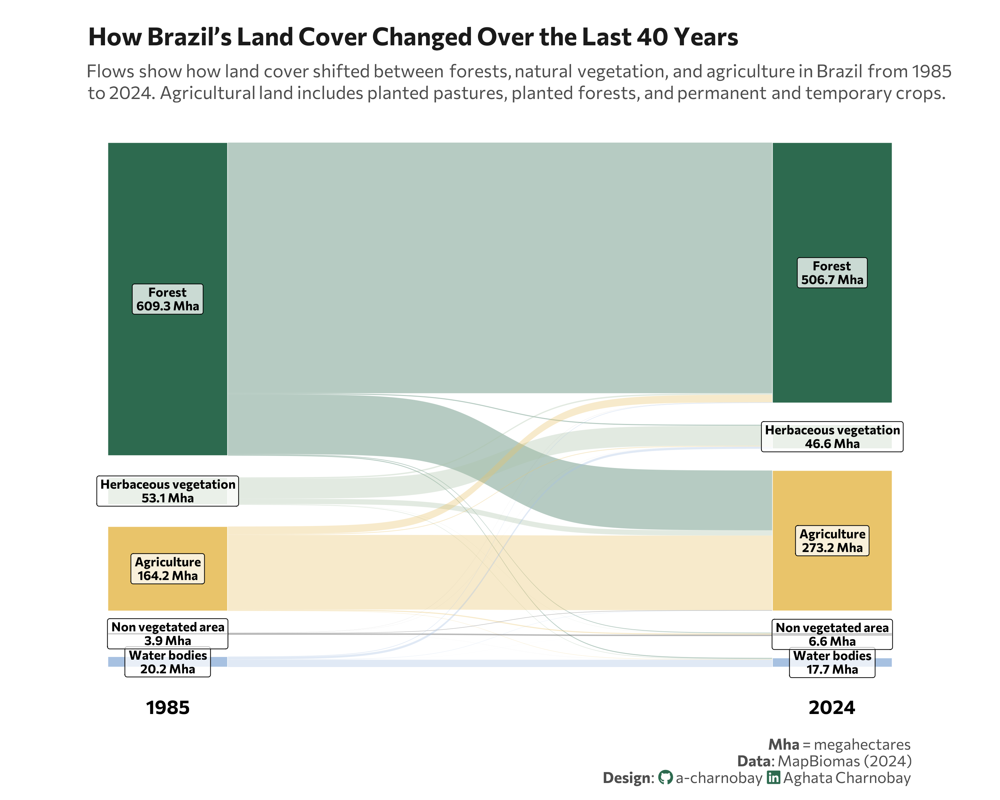

<br> <br>

{fig-align="center" width="593"}

## 1 Setup

### 1.1 Load R packages

```{r}
#| label: Load R packages
#| output: false

library(tidytext)
library(ggtext)       
library(showtext) 
library(stringr)
library(tidyverse)
library(here)
library(readxl)
library(ggalluvial)
library(ggsankey)
```

### 1.2 Load data

```{r}
#| label: Load and clean dataset
#| output: false

df <- read.csv("sankey_diagram.csv")
colnames(df) <- c("start", "end", "area")

```

### 1.3 Set theme

```{r}
#| label: Theme and appearance

# Font setup 
font_add_google("Commissioner")
showtext_auto()
showtext_opts(dpi = 300)
font_main <- "Commissioner"

# Font Awesome for caption
font_add(family = "fa-brands", regular = here("fonts", "Font Awesome 7 Brands-Regular-400.otf"))

# Colors
title_col <- "grey10"
text_col  <- "grey30"
bg_col    <- "#F2F4F8"

ecosystem_colors <- c(
  "Forest" = "#2D6A4F",
  "Agriculture" = "#E9C46A",
  "Herbaceous vegetation" = "#ADC2A9",
  "Water bodies" = "#A7C1E1",
  "Non vegetated area" = "grey20"
)

```

## 2 Prepare data for plotting

```{r}
#| label: Prepare for plotting

target_order <- rev(c(
  "Forest", 
  "Herbaceous vegetation", 
  "Agriculture", 
  "Non vegetated area", 
  "Water bodies"
))

df_sankey <- df |>
  mutate(
    area_mha = as.numeric(area) / 1000000,
    across(c(start, end), ~case_when(
      . == "Herbaceous and Shrubby Vegetation" ~ "Herbaceous vegetation",
      . == "Farming" ~ "Agriculture",
      . == "Water and Marine Environment" ~ "Water bodies",
      TRUE ~ .
    ))
  ) |>
  make_long(start, end, value = area_mha) |>
  group_by(x, node) |>
  mutate(label_full = paste0(node, "\n", round(sum(value, na.rm = TRUE), 1), " Mha")) |>
  ungroup() |>
  # Now levels = target_order will find the shortened names correctly
  mutate(
    node = factor(node, levels = target_order),
    next_node = factor(next_node, levels = target_order)
  )
```

## 3. Plot

```{r}
#| label: Plot

p <- ggplot(df_sankey, aes(x = x, 
                          next_x = next_x, 
                          node = node, 
                          next_node = next_node, 
                          fill = node,
                          label = label_full, 
                          value = value)) +
  
  geom_sankey(flow.alpha = 0.35, 
              node.color = "white", 
              node.size = 0.2,
              width = 0.18) + 
  
  # Labels
  geom_sankey_label(size = 3.2, 
                    color = "black", 
                    fill = "white", 
                    alpha = 0.75, 
                    family = font_main, 
                    fontface = "bold",
                    label.size = NA,
                    lineheight = 0.9) +
            
  scale_x_discrete(labels = c("1985", "2024"), expand = c(.06, .06)) +
  scale_fill_manual(values = ecosystem_colors) +
  # Labs
  labs(
    title = "How Brazil’s Land Cover Changed Over the Last 40 Years",
    subtitle = "Flows show how land cover shifted between forests, natural vegetation, and agriculture in Brazil from 1985<br> to 2024. Agricultural land includes planted pastures, planted forests, and permanent and temporary crops.",
    caption = paste0(
      "**Mha** = megahectares",
      "<br>**Data**: MapBiomas (2024)",
      "<br>**Design**: <span style='font-family:fa-brands; color:#2D6A4F;'>&#xf09b;</span> a-charnobay ",
      "<span style='font-family:fa-brands; color:#2D6A4F;'>&#xf08c;</span> Aghata Charnobay"
    )
  ) +
  # Styling
  theme_minimal(base_family = font_main) +
  theme(
    plot.title = element_text(face = "bold", size = 18, color = title_col, margin = margin(t = 10, b = 10)),
    plot.subtitle = element_markdown(size = 13, color = text_col, margin = margin(b = 10), lineheight = 1.2),
    plot.caption = element_markdown(size = 11, color = text_col, margin = margin(t = 15), lineheight = 1.1),
    plot.title.position = "plot",
    plot.margin = margin(10, 20, 10, 20), 
    panel.grid = element_blank(),
    axis.title.x = element_blank(),
    axis.text.x = element_text(face = "bold", size = 14, color = "black"),
    axis.title.y = element_blank(),
    axis.text.y = element_blank(),
    legend.position = "none",
    aspect.ratio = 0.7
  )

```

```{r}
#| label: Save plot
#| include: false
#| eval: false

ggsave(
  filename = "plot.png", 
  plot = p,
  width = 10, 
  height = 8,
  dpi = 300,
  bg = "white"
)
```
