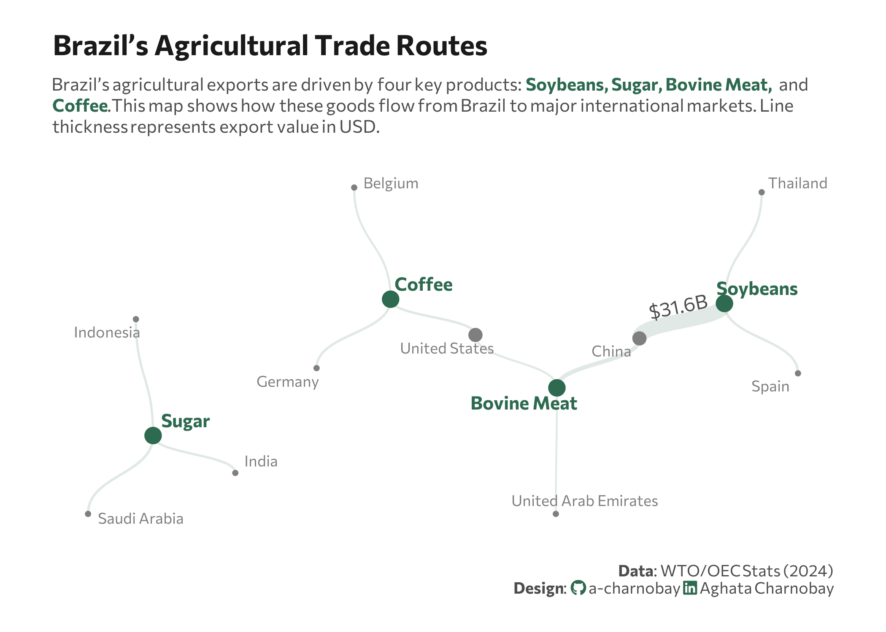

<br>
<br>



## 1 Setup

### 1.1 Load R packages

```{r}
#| label: Load R packages
#| output: false

library(tidytext)
library(ggtext)       
library(showtext) 
library(stringr)
library(tidyverse)
library(here)
library(ggraph)
library(tidygraph)

```

### 1.2 Load data 

```{r}
#| label: Load data

trade_data <- data.frame(
  from = c("Soybeans", "Soybeans", "Soybeans", "Sugar", "Sugar", "Sugar", 
           "Bovine Meat", "Bovine Meat", "Bovine Meat", "Coffee", "Coffee", "Coffee"),
  to = c("China", "Spain", "Thailand", "Saudi Arabia", "Indonesia", "India", 
         "China", "United States", "United Arab Emirates", "United States", "Germany", "Belgium"),
  value_raw = c("31600", "1800", "1520", "2050", "1700", "1640", 
                "5980", "889", "523", "1900", "1820", "1100")
) %>%
  mutate(value = as.numeric(value_raw))

```


### 1.3 Set theme

```{r}
#| label: Theme and appearance

# Font setup 
font_add_google("Commissioner")
showtext_auto()
showtext_opts(dpi = 300)
font_main <- "Commissioner"

# Font Awesome for caption
font_add(family = "fa-brands", regular = here("fonts", "Font Awesome 7 Brands-Regular-400.otf"))


# Colors
col_bg        <- "white"
title_col     <- "grey10"
text_col      <- "grey30"
col_highlight <- "#2D6A4F" 
col_country   <- "grey50"

```

## 2 Prepare data for plotting

```{r}
#| lable: Prepare for plotting

graph <- as_tbl_graph(trade_data, directed = FALSE) |>
  mutate(
    # Identify if node is a Product or Country for coloring
    type = if_else(name %in% trade_data$from, "Product", "Country"),
    # Calculate degree (number of connections) to scale node size
    importance = centrality_degree()
  )

```

## 3 Plot

```{r}
#| lable: Plot

set.seed(42) 

p <- ggraph(graph, layout = "stress") + 
  # relationship lines
  geom_edge_diagonal(
    aes(width = value), 
    alpha = 0.15, 
    color = col_highlight, 
    show.legend = FALSE
  ) +
# highlight connections
  geom_edge_diagonal(
    aes(
      width = value,
      label = if_else(value == 31600, "$31.6B", "") 
    ),
    alpha = 0, # Invisible line, only the label shows
    color = "transparent",
    family = font_main,
    size = 2.5, 
    label_colour = text_col,
    label_face = "bold.italic",      
    angle_calc = "along",      
    label_dodge = unit(3, "mm"),
    show.legend = FALSE
  ) +
  # Hubs 
  geom_node_point(aes(color = type, size = importance), 
                  show.legend = FALSE) +
  # Country labels
  geom_node_text(aes(label = if_else(type == "Country", name, NA_character_)),
                 color = col_country,
                 size = 3,
                 family = font_main,
                 repel = TRUE,
                 point.padding = unit(0.5, "lines"), 
                 min.segment.length = Inf) + 
  # Product labels
  geom_node_text(aes(label = if_else(type == "Product", name, NA_character_)),
                 color = col_highlight,
                 fontface = "bold",
                 size = 3.7,
                 family = font_main,
                 repel = TRUE,
                 point.padding = unit(1.8, "lines"),
                 min.segment.length = Inf) + 
  # Scales
  scale_color_manual(values = c("Product" = col_highlight, "Country" = col_country)) +
  scale_size_continuous(range = c(1, 4)) + 
  scale_edge_width_continuous(range = c(0.5, 4)) + 
  # Labs
  labs(
    title = "Brazil’s Agricultural Trade Routes",
    subtitle = paste0(
  "Brazil’s agricultural exports are driven by four key products: <span style='color:", col_highlight, ";'><b>Soybeans, Sugar, Bovine Meat, </b></span> and<br><span style='color:", col_highlight, ";'><b>Coffee</b></span>.",
  "This map shows how these goods flow from Brazil to major international markets. Line<br>thickness represents export value in USD."
),
    caption = paste0(
      "**Data**: WTO/OEC Stats (2024)",
      "<br>**Design**: <span style='font-family:fa-brands; color:#2D6A4F;'>&#xf09b;</span> a-charnobay ",
      "<span style='font-family:fa-brands; color:#2D6A4F;'>&#xf08c;</span> Aghata Charnobay"
    )
  ) +
  # styling
  theme_void(base_family = font_main) +
  theme(
    plot.margin = margin(20, 30, 20, 30),
    plot.title.position = "plot",
    plot.title = element_text(face = "bold", size = 16, color = title_col, margin = margin(b = 10)),
    plot.subtitle = element_markdown(size = 10, color = text_col, lineheight = 1.2, margin = margin(b = 20)),
    plot.caption = element_markdown(size = 9, color = text_col, margin = margin(t = 20), lineheight = 1.1),
    plot.background = element_rect(fill = col_bg, color = NA)
  )
```

```{r}
#| label: Save plot
#| include: false
#| eval: false

ggsave(
  filename = "plot.png", 
  plot = p,
  width = 7, 
  height = 5,
  dpi = 300,
  bg = "white"
)
```
