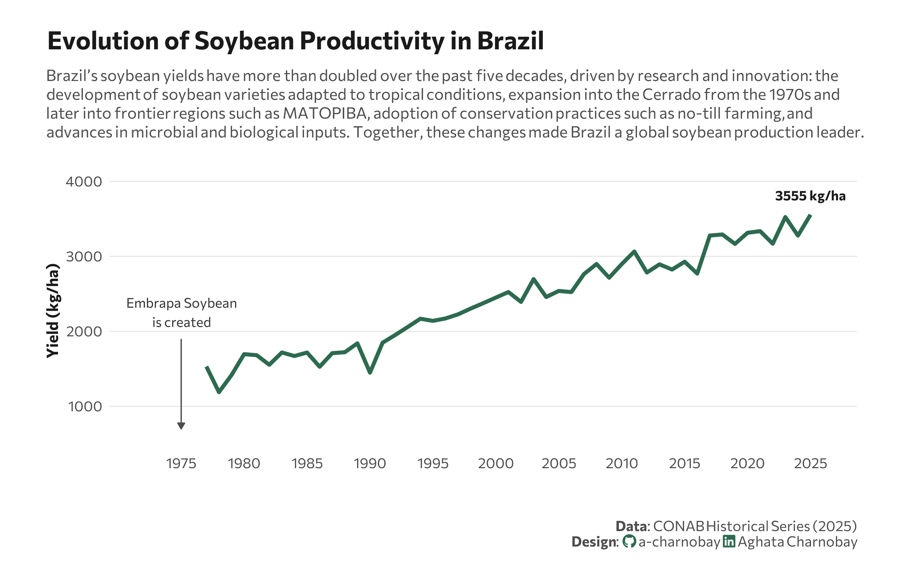

<br> <br>

{fig-align="center" width="599"}

## 1 Setup

### 1.1 Create R and Python connection

```{r}
#| label: Create R and Python connection

library(reticulate)
use_virtualenv("r-reticulate", required = TRUE) 
#py_config()

```

### 1.2 Load R packages

```{r}
#| label: Load R packages
#| output: false

library(tidytext)
library(ggtext)       
library(showtext) 
library(stringr)
library(tidyverse)
library(here)
```

### 1.3 Load data

```{python}
#| label: Load and clean dataset with Python
#| output: false

import agrobr
import asyncio
import pandas as pd
import numpy as np

from agrobr.sync import conab

soy_df = asyncio.run(agrobr.datasets.serie_historica_safra("soja"))
print(soy_df.head())

```

### 1.4 Set theme

```{r}
#| label: Theme and appearance

# Font setup 
font_add_google("Commissioner")
showtext_auto()
showtext_opts(dpi = 300)
font_main <- "Commissioner"

# Font Awesome for caption
font_add(family = "fa-brands", regular = here("fonts", "Font Awesome 7 Brands-Regular-400.otf"))

# Colors
title_col <- "grey10"
text_col  <- "grey30"
bg_col    <- "#F2F4F8"
col_line <- "#2D6A4F"


```

## 2 Prepare data for plotting

```{r}
#| label: Prepare for plotting

soy_df <- py$soy_df

yield <- soy_df |>
  mutate(produto = "Soybean") |>
  # Split "1976/77" into "1976" and "77"
  separate(safra, into = c("year_start", "year_end"), sep = "/", remove = FALSE) |>
  # Logic: If year_end is 00-25, it's 2000s. If it's 76-99, it's 1900s.
  mutate(year = as.numeric(year_end),
         year = ifelse(year <= 25, 2000 + year, 1900 + year)) |>
  group_by(produto, year) |>
  summarize(mean_yield = mean(produtividade_kg_ha, na.rm = TRUE)) |>
  ungroup()

```

## 3. Plot

```{r}
#| label: Plot

p <- ggplot(yield, aes(x = year, y = mean_yield, group = 1)) +
  # Annotation
 annotate("text", 
         x = 1975,               
         y = 2250, 
         label = "Embrapa Soybean\nis created", 
         family = font_main, 
         size = 3, 
         hjust = 0.5,            
         fontface = "italic", 
         color = "grey20") +
  annotate("segment", 
           x = 1975, xend = 1975,   
           y = 1900, yend = 700,     
           color = "grey30", 
           size = 0.4,
           arrow = arrow(length = unit(0.15, "cm"), type = "closed")) +
  geom_line(color = col_line, size = 1.2) +
  geom_text(data = yield %>% slice_tail(n = 1),
            aes(label = paste0(round(mean_yield, 0), " kg/ha")),
            vjust = -1.5, family = font_main, fontface = "bold", color = title_col, size = 3) +
  scale_y_continuous(expand = expansion(mult = c(0.1, 0.2))) +
  scale_x_continuous(breaks = seq(1975, 2025, by = 5), limits = c(1972, 2026)) +
  labs(
    title = "Evolution of Soybean Productivity in Brazil",
    subtitle = "Brazil’s soybean yields have more than doubled over the past five decades, driven by research and innovation: the<br>development of soybean varieties adapted to tropical conditions, expansion into the Cerrado from the 1970s and<br>later into frontier regions such as MATOPIBA, adoption of conservation practices such as no-till farming, and<br>advances in microbial and biological inputs. Together, these changes made Brazil a global soybean production leader.",
    x = "",
    y = "Yield (kg/ha)",
    caption = paste0(
      "**Data**: CONAB Historical Series (2025)",
      "<br>**Design**: <span style='font-family:fa-brands; color:#2D6A4F;'>&#xf09b;</span> a-charnobay ", 
      "<span style='font-family:fa-brands; color:#2D6A4F;'>&#xf08c;</span> Aghata Charnobay"
    )
  ) +
  # Styling
  theme_minimal(base_family = font_main) +
  theme(
    plot.title.position = "plot",
    plot.title = element_text(face = "bold", size = 16, color = title_col, margin = margin(b = 10)),
    plot.subtitle = element_markdown(size = 10, color = text_col, margin = margin(b = 20), lineheight = 1.2),
    plot.caption = element_markdown(size = 9, color = text_col, margin = margin(t = 20),lineheight = 1.1 ),
    panel.grid.minor = element_blank(),
    panel.grid.major.x = element_blank(),
    panel.grid.major.y = element_line(color = "grey90", size = 0.3),
    axis.text = element_text(size = 9, color = text_col),
    axis.title = element_text(size = 10, face = "bold", color = title_col),
    plot.margin = margin(20, 30, 10, 30),
    plot.background = element_rect(fill = "white", color = NA)
  )
```

```{r}
#| label: Save plot
#| include: false
#| eval: false

ggsave(
  filename = "plot.png", 
  plot = p,
  width = 8, 
  height = 5,
  dpi = 300,
  bg = "white"
)
```
