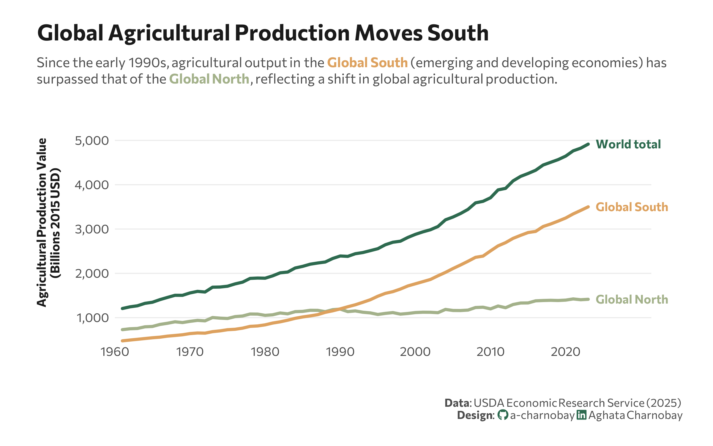

<br>
<br>



## 1 Setup

### 1.1 Load R packages

```{r}
#| label: Load R packages
#| output: false

library(tidytext)
library(ggtext)       
library(showtext) 
library(stringr)
library(tidyverse)
library(here)
library(readxl)
```

### 1.2 Load data

```{r}
# https://www.ers.usda.gov/publications/pub-details?pubid=108649

df <- read_excel("data.xlsx", sheet = 3)

```

### 1.3 Set theme

```{r}
#| label: Theme and appearance

# Font setup 
font_add_google("Commissioner")
showtext_auto()
showtext_opts(dpi = 300)
font_main <- "Commissioner"

# Font Awesome for caption
font_add(family = "fa-brands", regular = here("fonts", "Font Awesome 7 Brands-Regular-400.otf"))

# Colors
title_col <- "grey10"
text_col  <- "grey30"
bg_col    <- "#F2F4F8"

```

## 2 Prepare data for plotting

```{r}
#| label: Prepare for plotting

## Define the 'North' 
north_high_income_asia <- c("JPN", "KOR", "TWN", "SGP", "ISR")
north_fsu_states       <- c("SVU", "RUS", "UKR", "BLR", "MDA", "KAZ")
north_anglo_oceania    <- c("USA", "CAN", "AUS", "NZL")

# Process the data 
df_processed <- df |>
  filter(
    Variable == "Outall_Q",
    nchar(ISO3) == 3
  ) |> 
  mutate(
    Category = case_when(
      ISO3 %in% north_anglo_oceania ~ "Global North",
      ISO3 %in% north_high_income_asia ~ "Global North",
      ISO3 %in% north_fsu_states ~ "Global North",
      Region %in% c("EUROPE", "Former Soviet Union", "Transition countries") ~ "Global North",
      TRUE ~ "Global South"
    ),
    Value_Billions = Value / 1000000
  ) |>
  group_by(Year, Category) |>
  summarise(
    Total = sum(Value_Billions, na.rm = TRUE), 
    .groups = "drop"
  )

# World Total Line
world_total <- df_processed |>
  group_by(Year) |>
  summarise(
    Total = sum(Total), 
    Category = "World total"
  )

final_df <- bind_rows(df_processed, world_total)

# Create labels for the end of the lines
line_labels <- final_df |>
  filter(Year == max(Year))

```


## 3. Plot

```{r}
#| label: Plot

p <- ggplot(final_df, aes(x = Year, y = Total, color = Category)) +
  geom_line(linewidth = 1.2, lineend = "round") +
  scale_color_manual(values = c(
    "Global North" = "#a3b18a", 
    "Global South" = "#dda15e", 
    "World total"  = "#2D6A4F"
  )) +
  geom_text(data = line_labels, 
            aes(label = Category), 
            hjust = 0, 
            nudge_x = 1,   # pushed outside
            family = font_main, 
            fontface = "bold", 
            size = 3.5) +
  scale_y_continuous(
    labels = scales::comma,
    expand = expansion(mult = c(0, 0.2)),
    name = "Agricultural Production Value<br>(Billions 2015 USD)"
  ) +
  scale_x_continuous(
    breaks = seq(1960, 2028, by = 10),
    expand = expansion(mult = c(0, 0.05))
  ) +
  coord_cartesian(xlim = c(1960, 2028), clip = "off") +
  labs(
    title = "Global Agricultural Production Moves South",
    subtitle = "Since the early 1990s, agricultural output in the <b><span style='color:#dda15e;'>Global South</span></b> (emerging and developing economies) has<br>surpassed that of the <b><span style='color:#a3b18a;'>Global North</span></b>, reflecting a shift in global agricultural production.",
    x = "",
    caption = paste0(
      "**Data**: USDA Economic Research Service (2025)",
      "<br>**Design**: <span style='font-family:fa-brands; color:#2D6A4F;'>&#xf09b;</span> a-charnobay ", 
      "<span style='font-family:fa-brands; color:#2D6A4F;'>&#xf08c;</span> Aghata Charnobay"
    )
  ) +
  # Styling
  theme_minimal(base_family = font_main) +
  theme(
    plot.title.position = "plot",
    plot.title = element_text(face = "bold", size = 18, color = title_col, margin = margin(b = 10)),
    plot.subtitle = element_markdown(size = 11, color = text_col, margin = margin(b = 15), lineheight = 1.2),
    plot.caption = element_markdown(size = 9, color = text_col, margin = margin(t = 20), lineheight = 1.1, hjust = 1.1),
    panel.grid.minor = element_blank(),
    panel.grid.major.x = element_blank(),
    panel.grid.major.y = element_line(color = "grey92", linewidth = 0.4),
    axis.text = element_text(size = 10, color = text_col),
    axis.title.y = element_markdown(size = 10, face = "bold", color = title_col, margin = margin(r = 10), lineheight = 1.1),
    legend.position = "none",
    plot.margin = margin(20, 50, 20, 30),  
    plot.background = element_rect(fill = "white", color = NA)
  )
```

```{r}
#| label: Save plot
#| include: false
#| eval: false

ggsave(
  filename = "plot.png", 
  plot = p,
  width = 8, 
  height = 5,
  dpi = 300,
  bg = "white"
)
```

