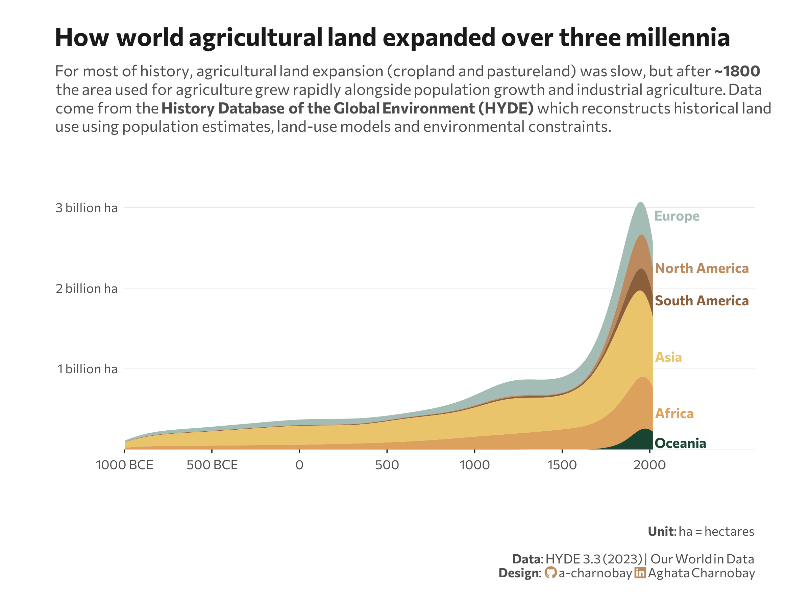

<br>
<br>



## 1 Setup

### 1.1 Load R packages

```{r}
#| label: Load R packages
#| output: false

library(tidytext)
library(ggtext)       
library(showtext) 
library(stringr)
library(tidyverse)
library(here)
library(readr)
library(scales)
library(ggstream)
library(zoo)
```

### 1.2 Load data

```{r}
# https://ourworldindata.org/land-use : Total agricultural land use

df <- read_csv("hyde-longterm-agricultural-land-change.csv")
head(df)

```

### 1.3 Set theme

```{r}
#| label: Theme and appearance

# Font setup 
font_add_google("Commissioner")
showtext_auto()
showtext_opts(dpi = 300)
font_main <- "Commissioner"

# Font Awesome for caption
font_add(family = "fa-brands", regular = here("fonts", "Font Awesome 7 Brands-Regular-400.otf"))

# Colors
title_col <- "grey10"
text_col  <- "grey30"
bg_col    <- "#F2F4F8"

```

## 2 Prepare data for plotting

```{r}
#| label: Prepare for plotting

# 1. Global Settings
target_regions <- c(
  "Europe",
  "North America",
  "South America",
  "Asia",
  "Africa",
  "Oceania"
)

hyde_colors_clean <- c(
  "Europe"                       = "#A3BCB5", 
  "North America"                = "#BC8A5F",
  "South America"                = "#8B5E3C",
  "Asia"                         = "#E9C46A",
  "Africa"                       = "#DDA15E",
   "Oceania"                     = "#1B4332"
)

clean_years <- seq(-1000, 2020, by = 20)

plot_data_final <- df |>
  filter(Entity %in% target_regions, Year >= -1000) |>
  rename(ag_land = `Land use: Agriculture`) |>
  mutate(Entity = factor(Entity, levels = target_regions)) |>
  
  # Time-series Regularization
  complete(Year = clean_years, Entity, fill = list(ag_land = NA)) |>
  group_by(Entity) |>
  mutate(
    ag_land = na.approx(ag_land, x = Year, na.rm = FALSE),
    ag_land = replace_na(ag_land, 0),
    # --- CONVERT TO BILLIONS ---
    ag_land = ag_land / 1e9, 
    # Adjust threshold for geom_stream stability now that units are smaller
    ag_land = ifelse(ag_land < 0.000001, 0, ag_land) 
  ) |>
  ungroup() |>
  filter(Year %in% clean_years)
```

## 3. Plot

```{r}
#| label: Plot

p <- plot_data_final %>% 
  ggplot(aes(x = Year, y = ag_land, fill = Entity)) +
  
  geom_stream(
    type = "ridge", 
    bw = 0.75, 
    n_grid = 1000, 
    sorting = "none",
    extra_span = 0.1
  ) +
  # Continent labels
  annotate("text", x = 2030, y = 0.08, label = "Oceania", 
           color = hyde_colors_clean["Oceania"], fontface = "bold", hjust = 0, family = font_main, size = 3.5) +
      
  annotate("text", x = 2030, y = 0.45, label = "Africa", 
           color = hyde_colors_clean["Africa"], fontface = "bold", hjust = 0, family = font_main, size = 3.5) +
          
  annotate("text", x = 2030, y = 1.15, label = "Asia", 
           color = hyde_colors_clean["Asia"], fontface = "bold", hjust = 0, family = font_main, size = 3.5) +
           
  annotate("text", x = 2030, y = 1.85, label = "South America", 
           color = hyde_colors_clean["South America"], fontface = "bold", hjust = 0, family = font_main, size = 3.5) +
           
  annotate("text", x = 2030, y = 2.25, label = "North America", 
           color = hyde_colors_clean["North America"], fontface = "bold", hjust = 0, family = font_main, size = 3.5) +
           
  annotate("text", x = 2030, y = 2.90, label = "Europe", 
           color = hyde_colors_clean["Europe"], fontface = "bold", hjust = 0, family = font_main, size = 3.5) +

 # Scales
  scale_y_continuous(
    limits = c(0, 3.3), # Increased slightly so top label isn't cramped
    labels = function(x) ifelse(x == 0, "", paste(x, "billion ha")),
    breaks = seq(0, 3, by = 1),
    expand = expansion(mult = c(0, 0.05)) 
  ) +
  scale_x_continuous(
    limits = c(-1000, 2600), # Expanded to 2600 for text space
    breaks = seq(-1000, 2000, by = 500),
    labels = function(x) ifelse(x < 0, paste0(abs(x), " BCE"), x),
    expand = c(0, 0)
  ) +
  scale_fill_manual(values = hyde_colors_clean) +
  guides(fill = guide_legend(nrow = 1)) + 
  # Labs
  labs(
    title = "How world agricultural land expanded over three millennia",
    subtitle = paste0("For most of history, agricultural land expansion (cropland and pastureland) was slow, but after **~1800**<br>the area used for agriculture grew rapidly alongside population growth and industrial agriculture. Data<br>come from the **History Database of the Global Environment (HYDE)** which reconstructs historical land<br>use using population estimates, land-use models and environmental constraints."
  ),
    caption = paste0(
      "**Unit**: ha = hectares",
      "<br><br>**Data**: HYDE 3.3 (2023) | Our World in Data",
      "<br>**Design**: <span style='font-family:fa-brands; color:#BC8A5F;'>&#xf09b;</span> a-charnobay ",
      "<span style='font-family:fa-brands; color:#BC8A5F;'>&#xf08c;</span> Aghata Charnobay"
    ),
    x = ""
  )  +
  #Styling
  theme_minimal(base_family = font_main) +
  theme(
    plot.background = element_rect(fill = "white", color = NA),
    panel.background = element_rect(fill = "white", color = NA),
    plot.margin = margin(20, 40, 20, 40),
    plot.title = element_markdown(face = "bold", size = 18, color = title_col, margin = margin(b = 10)),
    plot.subtitle = element_markdown(size = 11, color = text_col, margin = margin(b = 25), lineheight = 1.2),
    plot.title.position = "plot",
    plot.caption = element_markdown(size = 9, color = text_col, lineheight = 1.1, margin = margin(t = 20)),
    panel.grid.minor = element_blank(),
    panel.grid.major = element_line(color = "grey90", linewidth = 0.2),
    panel.grid.major.x = element_blank(),
    axis.text = element_text(color = text_col, size = 9),
    axis.title.x = element_text(margin = margin(t = 9), face = "bold", color = title_col),
    axis.ticks.x = element_line(color = title_col, linewidth = 0.4),
    axis.title.y = element_blank(),
    legend.position = "none",
  )

```

```{r}
#| label: Save plot
#| include: false
#| eval: false

ggsave(
  filename = "plot.png", 
  plot = p,
  width = 8, 
  height = 6,
  dpi = 300,
  bg = "white"
)
```

