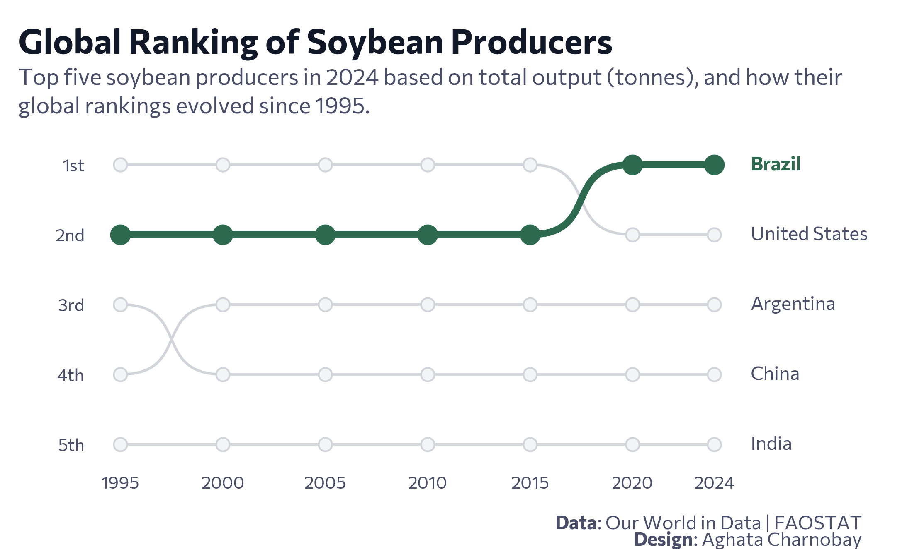

<br>
<br>



## 1 Setup

### 1.1 Create R and Python connection

```{r}
#| label: Create R and Python connection

library(reticulate)
use_virtualenv("r-reticulate", required = TRUE) 
#py_config()

```

### 1.2 Load Python libraries

```{python}
#| label: Load Python libraries
#| output: false

import pandas as pd
import matplotlib.pyplot as plt
import highlight_text as ht
from pyfonts import set_default_font, load_google_font
from bumplot import bumplot, opts_from_color

```

### 1.3 Load data

```{python}
#| label: Load dataset with Python

# https://ourworldindata.org/agricultural-production -> Soybeans: Production
df = pd.read_csv("soybean-production.csv")
df = df.rename(columns={'Soybeans - Production (tonnes)': 'Production'})

```


### 1.4 Set theme

```{python}
#| label: Theme and appearance
#| output: false

# Fonts
font = load_google_font("Commissioner")
font_bold = load_google_font("Commissioner", weight="bold")
set_default_font(font)

# Colors
text_col = "#111827"
subtext_col = "#4a4e69"
cap_col = "#111827"

# Highlight style
h_styles = [{"fontproperties": font_bold}]
```

## 2. Exploratory data analysis

```{python}
#| label: Exploratory data analysis

# Filter for countries
df_countries = df[
    (df['Entity'] != 'World') & 
    (~df['Code'].str.contains('OWID|_', na=False)) & 
    (~df['Entity'].str.contains(r'\(FAO\)', na=False)) &
    (df['Code'].str.len() == 3)
].copy()

latest_year = df_countries['Year'].max()

# Top 5
top_5_entities = (
    df_countries[df_countries['Year'] == latest_year]
    .sort_values('Production', ascending=False)
    .head(5)['Entity']
    .tolist()
)

df_top = df_countries[df_countries['Entity'].isin(top_5_entities)].copy()

# Pivot and Rank
df_ranked = df_top.pivot(index='Year', columns='Entity', values='Production')
df_ranked = df_ranked.rank(axis=1, ascending=True, method='min').reset_index()

```

## 3. Prepare data for plotting

```{python}
#| label: Prepare data for plotting

# Data prep

countries = ["Brazil", "United States", "Argentina", "China", "India"]
years = [1995, 2000, 2005, 2010, 2015, 2020, 2024]

# Filter, Pivot, and Rank
df_filtered = df[df["Entity"].isin(countries) & df["Year"].isin(years)]
df_pivot = df_filtered.pivot(index="Year", columns="Entity", values="Production")

# Rank 1 = Highest Production
df_ranked = df_pivot.rank(axis=1, ascending=True, method='min').reset_index()
```

## 4. Plot

```{python}
#| label: Plot
#| output: false

highlight = {
    "Brazil": opts_from_color("#2D6A4F", zorder=3, line_width=4, marker_size=120),
}
countries_to_plot = [col for col in df_ranked.columns if col != "Year"]

# Create the Bump Plot

fig, ax = plt.subplots(figsize=(12, 8), dpi=100)

_, bump_artists = bumplot(
    x="Year",
    y_columns=[(name, highlight.get(name, {})) for name in countries_to_plot],
    data=df_ranked,
    curve_force=0.7,
    ordinal_labels=True,
    colors=["#D1D5DB"],
    scatter_kwargs={
        "edgecolor": "#D1D5DB",
        "s": 60,
        "linewidth": 1,
        "facecolor": "#F3F4F6",
    },
    plot_kwargs={"linewidth": 1.5},
)

# Styling

fig.subplots_adjust(
    top=0.73,
    bottom=0.18,
    left=0.10,
    right=0.82
)

ax.spines[["top", "right", "left", "bottom"]].set_visible(False)
ax.tick_params(axis="x", labelsize=10, pad=10, colors="#4a4e69")
ax.tick_params(size=0)

# Set Y-axis to show 1 to 5 exactly
ax.set_yticks([1, 2, 3, 4, 5])
ax.set_yticklabels(["1st", "2nd", "3rd", "4th", "5th"], color="#4a4e69")

# country labels
for country in countries_to_plot:
    if country in bump_artists:
        _, scatter = bump_artists[country]
        _, last_y = scatter.get_offsets()[-1]

        color = "#2D6A4F" if country == "Brazil" else "#4a4e69"
        weight_font = font_bold if country == "Brazil" else font

        ax.text(
            x=1.01, 
            y=last_y,
            s=country,
            size=11,
            color=color,
            va="center",
            ha="left",
            fontproperties=weight_font,
            transform=ax.get_yaxis_transform(),
        )

# Labs

# Title
ht.fig_text(
    x=0.02, y=0.95, 
    s="Global Ranking of Soybean Producers", 
    color=text_col, fontsize=20, va='top', 
    fontproperties=font_bold, fig=fig
)

# Subtitle
ht.fig_text(
    x=0.02, y=0.88, 
    s="Top five soybean producers in 2024 based on total output (tonnes), and how their\nglobal rankings evolved since 1995.",
    color="#4a4e69", fontsize=13, va='top', 
    fontproperties=font, fig=fig
)

# Caption 

ht.fig_text(
    x=0.95, y=0.08, 
    s="<Data>: Our World in Data | FAOSTAT", 
    color="#4a4e69", fontsize=11, va='top', ha='right',
    highlight_textprops=h_styles,
    fontproperties=font, fig=fig
)

ht.fig_text(
    x=0.95, y=0.05, 
    s="<Design>: Aghata Charnobay", 
    color="#4a4e69", fontsize=11, va='top', ha='right',
    highlight_textprops=h_styles,
    fontproperties=font, fig=fig
)

```

## 5. Save plot

```{python}
#| label: Save plot
#| output: false
#| eval: false

plt.savefig("plot.png", dpi=300, facecolor='white')

```
