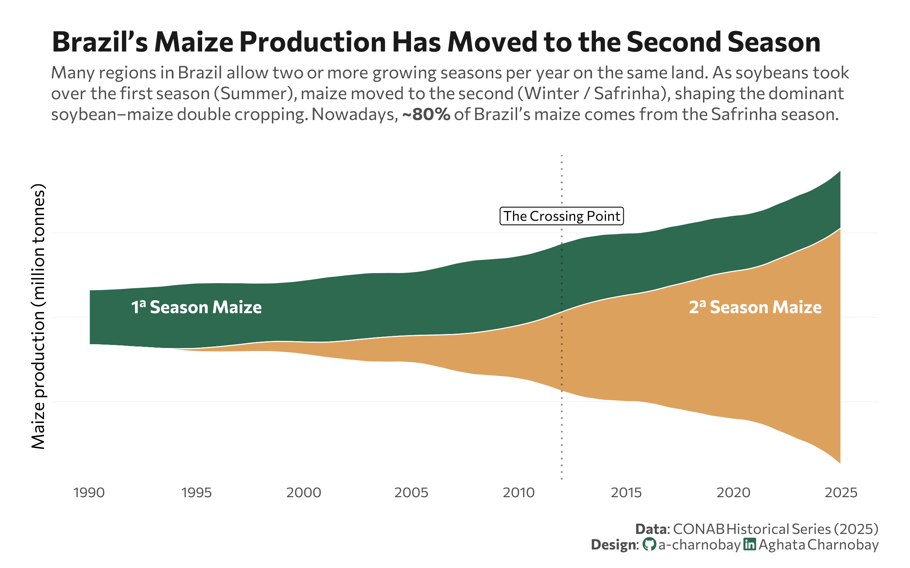

<br> <br>



## 1 Setup

### 1.1 Create R and Python connection

```{r}
#| label: Create R and Python connection

library(reticulate)
use_virtualenv("r-reticulate", required = TRUE) 
#py_config()

```


### 1.2 Load R packages

```{r}
#| label: setup
#| output: false

library(tidyverse)
library(ggstream)
library(ggtext)
library(showtext)
library(here)
```

### 1.3 Load data

```{python}
#| label: Load and clean dataset with Python
#| output: false

import agrobr
import asyncio
import pandas as pd
import numpy as np

from agrobr.sync import conab

maize_1= asyncio.run(agrobr.datasets.serie_historica_safra("milho_1"))
maize_2 = asyncio.run(agrobr.datasets.serie_historica_safra("milho_2"))

```

```{r}
#| label: data-loading

maize_1 <- py$maize_1
maize_2 <-py$maize_2
```

### 1.3 Set theme

```{r}
#| label: theme-settings

# Font setup 
font_add_google("Commissioner")
showtext_auto()
font_main <- "Commissioner"

# Colors
col_safra1 <- "#2D6A4F"  # Forest Green
col_safra2 <- "#dda15e"  # Earthy Gold
title_col  <- "grey10"
text_col   <- "grey30"
```

## 2 Prepare data for plotting
```{r}
#| label: data-prep

clean_maize_data <- function(df, label) {
  df |>
    mutate(year = as.numeric(str_extract(safra, "^\\d{4}")) + 1) |>
    group_by(year) |>
    summarise(production = sum(producao_mil_ton, na.rm = TRUE)) |>
    mutate(harvest = label)
}

df_plot <- bind_rows(
  clean_maize_data(maize_1, "1ª Season (Summer)"),
  clean_maize_data(maize_2, "2ª Season (Winter)")
) |>
  filter(year >= 1990)
```

## 3 Plot

```{r}
#| label: streamgraph-plot
#| fig-width: 8
#| fig-height: 5

p <- ggplot(df_plot, aes(x = year, y = production, fill = harvest)) +
  geom_stream(type = "mirror", bw = 0.75, color = "white", lwd = 0.3) +
  geom_vline(xintercept = 2012, color = title_col, linetype = "dotted", alpha = 0.5) +
  scale_fill_manual(values = c("1ª Season (Summer)" = col_safra1, 
                               "2ª Season (Winter)" = col_safra2)) +
  scale_x_continuous(breaks = seq(1990, 2025, 5)) +
  # Labs
  labs(
    title = "Brazil’s Maize Production Has Moved to the Second Season",
    subtitle = "Many regions in Brazil allow two or more growing seasons per year on the same land. As soybeans took<br>over the first season (Summer), maize moved to the second (Winter / Safrinha), shaping the dominant<br>soybean–maize double cropping. Nowadays, **~80%** of Brazil’s maize comes from the Safrinha season.",
    caption = paste0(
      "**Data**: CONAB Historical Series (2025)",
      "<br>**Design**: <span style='font-family:fa-brands; color:#2D6A4F;'>&#xf09b;</span> a-charnobay ", 
      "<span style='font-family:fa-brands; color:#2D6A4F;'>&#xf08c;</span> Aghata Charnobay"
    ),
    x = NULL,
    y = "Maize production (million tonnes)"
  ) +
  # Styling
  theme_minimal(base_family = font_main) +
  theme(
    panel.grid.major.x = element_blank(),
    panel.grid.minor = element_blank(),
    panel.grid.major.y = element_line(color = "grey90", size = 0.1),
    axis.text.y = element_blank(), 
    plot.title = element_text(face = "bold", size = 18, color = title_col),
    plot.subtitle = element_markdown(size = 11, color = text_col, margin = margin(b = 20), lineheight = 1.2),
    plot.caption = element_markdown(size = 9, color = text_col, margin = margin(t = 15), lineheight = 1.1),
    legend.position = "none",
    plot.margin = margin(20, 20, 10, 20)) +
  # Annotations - Adjusted Y values for real production scale (~15k to ~40k)
  annotate("text", x = 1995, y = 5000, label = "1ª Season Maize", 
           family = font_main, fontface = "bold", color = "white", size = 4) +
  annotate("text", x = 2021, y = 5000, label = "2ª Season Maize", 
           family = font_main, fontface = "bold", color = "white", size = 4) +
  annotate("label", x = 2012, y = 48000, label = "The Crossing Point", 
           family = font_main, size = 3, label.size = 0, fill = "white", alpha = 0.8)

p
```

```{r}
#| label: Save plot
#| include: false
#| eval: false

ggsave(
  filename = "plot.png", 
  plot = p,
  width = 8, 
  height = 5,
  dpi = 300,
  bg = "white"
)
```