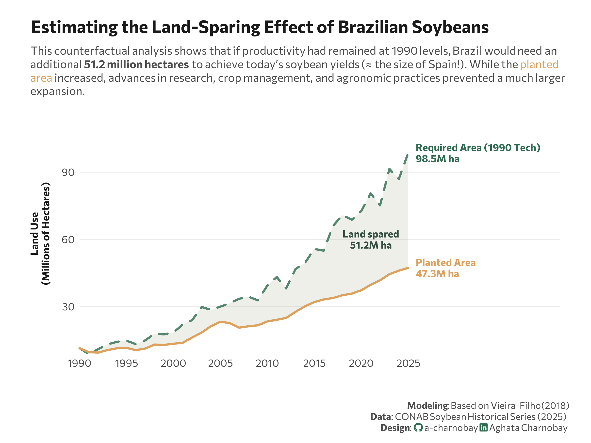

<br> <br>



## 1 Setup

### 1.1 Create R and Python connection

```{r}
#| label: Create R and Python connection

library(reticulate)
use_virtualenv("r-reticulate", required = TRUE) 
#py_config()

```

### 1.2 Load R packages

```{r}
#| label: Load R packages
#| output: false

library(tidytext)
library(ggtext)       
library(showtext) 
library(stringr)
library(tidyverse)
library(here)
library(ggpubr)
```

### 1.3 Load data

```{python}
#| label: Load and clean dataset with Python
#| output: false

# The idea came from: https://agro.insper.edu.br/en/agro-in-data/artigos/efeito-poupa-terra-produtividade-e-a-chave-para-a-su# stentabilidade-ambiental-do-agro-brasileiro

import agrobr
import asyncio
import pandas as pd
import numpy as np

from agrobr.sync import conab

soy_df = asyncio.run(agrobr.datasets.serie_historica_safra("soja"))

```

### 1.4 Set theme

```{r}
#| label: Theme and appearance

# Font setup 
font_add_google("Commissioner")
showtext_auto()
showtext_opts(dpi = 300)
font_main <- "Commissioner"

# Font Awesome for caption
font_add(family = "fa-brands", regular = here("fonts", "Font Awesome 7 Brands-Regular-400.otf"))

# Colors
title_col <- "grey10"
text_col  <- "grey30"
bg_col    <- "#F2F4F8"
col_line <- "#2D6A4F"

```

## 2 Prepare data for plotting

```{r}
#| label: Prepare for plotting

soy_df <- py$soy_df


# Find the top 5 ranked soybean producers for that year

latest_safra <- max(soy_df$safra)

top_5_ranking <- soy_df |>
  filter(safra == latest_safra, uf != "BRASIL") |>
  mutate(producao_mil_ton = as.numeric(producao_mil_ton)) |>
  arrange(desc(producao_mil_ton)) |>
  slice(1:5) |>
  pull(uf)

top_5_ufs <- c("MT", "GO", "PR", "RS", "MS")

# Prepare for plotting

plot_df <- soy_df %>%
  mutate(year = as.numeric(substr(safra, 1, 4)) + 1,
         area = as.numeric(area_plantada_mil_ha),
         prod = as.numeric(producao_mil_ton)) %>%
  filter(year >= 1990) %>%
  filter(uf != "BRASIL") %>% 
  group_by(year) %>%
  summarise(
    area_real = sum(area, na.rm = TRUE) / 1000, # Convert to millions
    prod_total = sum(prod, na.rm = TRUE)
  ) %>%
  arrange(year) %>%
  mutate(
    produt_1990 = first(prod_total) / (first(area_real) * 1000),
    area_hipotetica = (prod_total / produt_1990) / 1000,
    poupa_terra = area_hipotetica - area_real # The land sparing effect
  )

# Label for lines
label_data <- plot_df %>%
  filter(year == max(year)) %>%
  mutate(land_saved = area_hipotetica - area_real) %>%
  pivot_longer(cols = c(area_real, area_hipotetica), names_to = "category", values_to = "value") %>%
  mutate(
    label_text = case_when(
      category == "area_real" ~ paste0("Planted Area\n", round(value, 1), "M ha"),
      category == "area_hipotetica" ~ paste0("Required Area (1990 Tech)\n", round(value, 1), "M ha")
    )
  )

# Label for "land spared"
saved_label <- plot_df %>%
  filter(year == max(year)) %>%
  mutate(
    mid_y = (area_real + area_hipotetica) / 2,
    label = paste0("Land spared\n", round(area_hipotetica - area_real, 1), "M ha")
  )

# Extract values for subtitle
total_saved <- round(max(plot_df$poupa_terra), 1)

```

## 3. Plot

```{r}
#| label: Plot

p <- ggplot(plot_df, aes(x = year)) +
  # Ribbon (land spared area)
  geom_ribbon(aes(ymin = area_real, ymax = area_hipotetica), 
              fill = "#a3b18a", alpha = 0.2) +
  # Lines
  geom_line(aes(y = area_hipotetica), 
            color = "#2D6A4F", linewidth = 1, linetype = "dashed", alpha = 0.8, lineend = "round") +
  geom_line(aes(y = area_real), 
            color = "#dda15e", linewidth = 1, lineend = "round") +
  # Labels 
  geom_text(data = label_data, 
            aes(y = value, label = label_text, color = category),
            hjust = 0, nudge_x = 0.8, family = font_main, fontface = "bold", 
            size = 3.5, lineheight = 0.9) +
  geom_text(data = saved_label,
            aes(x = 2021, y = 60, label = label),
            family = font_main,
            color = "#344e41",
            size = 3.5,
            lineheight = 0.9,
            fontface = "bold",
            hjust = 0.5) +
  scale_color_manual(values = c("area_real" = "#dda15e", "area_hipotetica" = "#2D6A4F")) +
  # Scales
  scale_y_continuous(
    labels = scales::comma,
    expand = expansion(mult = c(0, 0.2)),
    name = "Land Use<br>(Millions of Hectares)"
  ) +
  scale_x_continuous(
    breaks = seq(1990, 2025, by = 5), 
    limits = c(1990, 2030),
    expand = expansion(mult = c(0, 0.28))
  ) +
  coord_cartesian(clip = "off") +
  # Labs
  labs(
    title = "Estimating the Land-Sparing Effect of Brazilian Soybeans",
    subtitle = paste0(
  "This counterfactual analysis shows that if productivity had remained at 1990 levels, Brazil would need an<br>additional <b>",
  total_saved,
  " million hectares</b> to achieve today’s soybean yields (≈ the size of Spain!). While the <span style='color:#dda15e;'>planted<br>area</span> increased, advances in research, crop management, and agronomic practices prevented a much larger<br>expansion."
),
    x = "",
    caption = paste0(
      "**Modeling**: Based on Vieira-Filho (2018)",
      "<br>**Data**: CONAB Soybean Historical Series (2025)",
      "<br>**Design**: <span style='font-family:fa-brands; color:#2D6A4F;'>&#xf09b;</span> a-charnobay ", 
      "<span style='font-family:fa-brands; color:#2D6A4F;'>&#xf08c;</span> Aghata Charnobay"
    )
  ) +
  # Styling
  theme_minimal(base_family = font_main) +
  theme(
    plot.title.position = "plot",
    plot.title = element_text(face = "bold", size = 17, color = title_col, margin = margin(b = 10)),
    plot.subtitle = element_markdown(size = 11, color = text_col, margin = margin(b = 15), lineheight = 1.2),
    plot.caption = element_markdown(size = 9, color = text_col, margin = margin(t = 20, r = 20), lineheight = 1.2, hjust = 1.1),
    panel.grid.minor = element_blank(),
    panel.grid.major.x = element_blank(),
    panel.grid.major.y = element_line(color = "grey92", linewidth = 0.4),
    axis.text = element_text(size = 10, color = text_col),
    axis.title.y = element_markdown(size = 10, face = "bold", color = title_col, margin = margin(r = 10), lineheight = 1.1),
    legend.position = "none",
    plot.margin = margin(20, 30, 10, 30),
    plot.background = element_rect(fill = "white", color = NA)
  )
```

```{r}
#| label: Save plot
#| include: false
#| eval: false

ggsave(
  filename = "plot.png", 
  plot = p,
  width = 8, 
  height = 6,
  dpi = 300,
  bg = "white"
)
```

