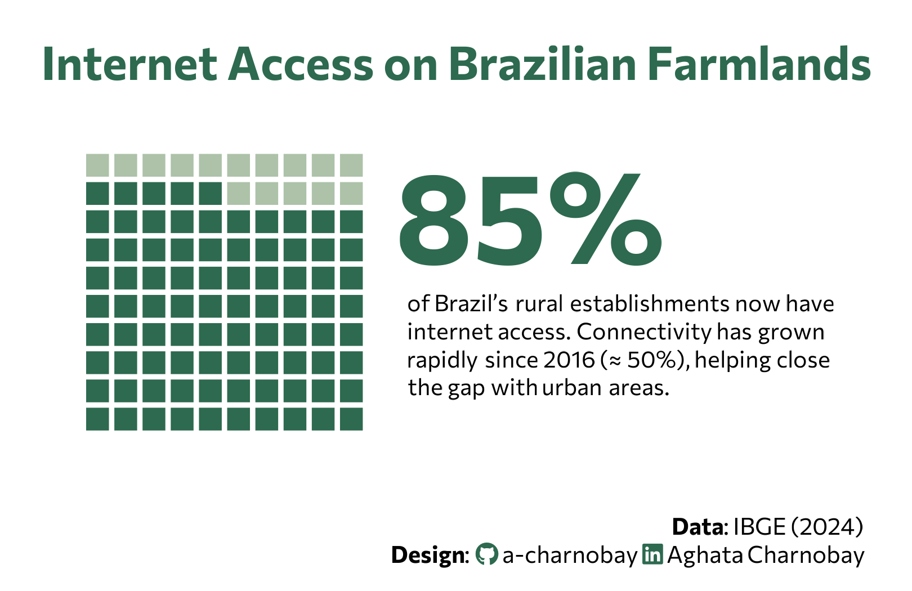

<br>
<br>



## 1 Setup

### 1.1 Load R packages

```{r}
#| label: Load R packages
#| output: false

library(tidytext)
library(ggtext)       
library(showtext) 
library(stringr)
library(tidyverse)
library(here)
library(patchwork)
```

### 1.2 Load data

```{r}
#| label: Load data 
#| output: false

percent_value <- 85

waffle_data <- expand.grid(x = 1:10, y = 1:10) |>
  arrange(y, x) |>
  mutate(
    id = row_number(),
    status = if_else(id <= percent_value, "Filled", "Empty")
  )

```

### 1.3 Set theme

```{r}
#| label: Theme and appearance

# Font setup 
font_add_google("Commissioner")
showtext_auto()
showtext_opts(dpi = 300)
font_main <- "Commissioner"

# Font Awesome for caption
font_add(family = "fa-brands", regular = here("fonts", "Font Awesome 7 Brands-Regular-400.otf"))

# Colors
title_col     <- "#F2F4F8"
text_col      <- "#F2F4F8"
bg_color      <-  "black"

# Monochrome Palette
waffle_fill  <- "#F2F4F8" 
waffle_unfill <- "grey40"
```

## 2. Plot

```{r}
#| label: Plot

# Left: The Waffle
p_left <- ggplot(waffle_data) +
  geom_tile(aes(x, y, fill = status), 
            width = 0.95, height = 0.95, 
            color = bg_color, linewidth = 0.8) + 
  scale_fill_manual(values = c("Filled" = waffle_fill, "Empty" = waffle_unfill)) +
  coord_equal() +
  theme_void() +
  theme(legend.position = "none", plot.background = element_blank())

# Right: The Metric
p_right <- ggplot() +
  annotate("text", x = 0, y = 0.7, label = paste0(percent_value, "%"), 
           size = 19, family = font_main, fontface = "bold", color = waffle_fill, hjust = 0) + 
  annotate("richtext", x = 0, y = 0.35, 
           label = "of Brazil’s rural establishments now have<br>internet access. Connectivity has grown<br>rapidly since 2016 (≈ 50%), helping close<br>the gap with urban areas.",
           size = 3.5, family = font_main, color = text_col, fill = NA, label.color = NA, 
           hjust = 0, lineheight = 1.2) +
  xlim(0, 1) + ylim(0, 1) +
  theme_void() +
  theme(plot.background = element_blank())

# Together
p <- p_left + p_right + 
  plot_layout(widths = c(1, 1.5)) +
  plot_annotation(
    title = "Internet Access on Brazilian Farmlands",
    caption = paste0(
  "**Data**: IBGE (2024)",
  "<br>**Design**: <span style='font-family:fa-brands; color:grey40;'>&#xf09b;</span> a-charnobay ", 
  "<span style='font-family:fa-brands; color:grey40;'>&#xf08c;</span> Aghata Charnobay"
),
 theme = theme(
   plot.title = element_text(family = font_main, face = "bold", size = 20, hjust = 0.5,
                             color = title_col, margin = margin(b = 0)),
   plot.caption = element_markdown(family = font_main, size = 10, 
                                   color = text_col, margin = margin(t = 10), lineheight = 1.2, hjust = 1),
   plot.margin = margin(20, 30, 10, 30),
   plot.background = element_rect(fill = bg_color, color = NA)
    )
  )
```

```{r}
#| label: Save plot
#| include: false
#| eval: false

ggsave(
  filename = "plot.png", 
  plot = p,
  width = 5, 
  height = 3.5,
  dpi = 300,
  bg = "white"
)
```

